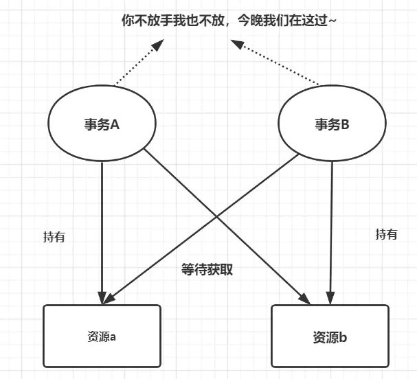

# 2024年金三银四面试突击班MYSQL专题---事务

### 1、什么是事务？

​		 事务是一个不可分割的数据库操作序列，也是数据库并发控制的基本单位，其执行的结果必须使数据库从一种一致性状态变到另一种一致性状态。事务是逻辑上的一组操作，要么都执行，要么都不执行。

### 2、事务的四大特性

**原子性（Atomicity）**

​		也就是我们刚才说的不可再分，也就意味着我们对数据库的一系列的操作，要么都是成功，要么都是失败，不可能出现部分成功或者部分失败的情况，以刚才提到的转账的场景为例，一个账户的余额减少，对应一个账户的增加，这两个一定是同时成功或者同时失败的。全部成功比较简单，问题是如果前面一个操作已经成功了，后面的操作失败了，怎么让它全部失败呢？这个时候我们必须要回滚。

​		原子性，在 InnoDB 里面是通过 undo log 来实现的，它记录了数据修改之前的值（逻辑日志），一旦发生异常，就可以用 undo log 来实现回滚操作。

**一致性（consistent）**

​		指的是数据库的完整性约束没有被破坏，事务执行的前后都是合法的数据状态。比如主键必须是唯一的，字段长度符合要求。

​		除了数据库自身的完整性约束，还有一个是用户自定义的完整性。

**举例：**

​		1.比如说转账的这个场景，A 账户余额减少 1000，B 账户余额只增加了 500，这个时候因为两个操作都成功了，按照我们对原子性的定义，它是满足原子性的， 但是它没有满足一致性，因为它导致了会计科目的不平衡。

​		2.还有一种情况，A 账户余额为 0，如果这个时候转账成功了，A 账户的余额会变成-1000，虽然它满足了原子性的，但是我们知道，借记卡的余额是不能够小于 0 的，所以也违反了一致性。用户自定义的完整性通常要在代码中控制。

**隔离性（isolation）**

​		有了事务的定义以后，在数据库里面会有很多的事务同时去操作我们的同一张表或者同一行数据，必然会产生一些并发或者干扰的操作，对隔离性就是这些很多个的事务，对表或者 行的并发操作，应该是透明的，互相不干扰的。通过这种方式，我们最终也是保证业务数据的一致性。

​		隔离性是通过MVCC以及锁来进行实现的，后续会对MVCC做详细的讲解

**持久性（Durable）**

​		我们对数据库的任意的操作，增删改，只要事务提交成功，那么结果就是永久性的，不可能因为我们重启了数据库的服务器，它又恢复到原来的状态了。

​		持久性怎么实现呢？数据库崩溃恢复（crash-safe）是通过什么实现的？持久性是通过 redo log 来实现的，我们操作数据的时候，会先写到内存的 buffer pool 里面，同时记录 redo log，如果在刷盘之前出现异常，在重启后就可以读取 redo log的内容，写入到磁盘，保证数据的持久性。

​		总结：原子性，隔离性，持久性，最后都是为了实现一致性

### 3、事务并发会带来什么问题？

​		当很多事务并发的去操作数据库的表或者行的时候，会出现脏读，不可重复读，幻读等问题。

​		（1）脏读

​		 当一个事务正在访问数据并且对数据进行了修改，但这种修改还没有提交到数据库中时，另一个事务也访问了这个数据并使用了它。这种情况下，第二个事务读取的数据是第一个事务尚未提交的修改，因此可能是不准确或不一致的。脏读通常发生在事务隔离级别较低的情况下，例如读未提交（Read Uncommitted）级别。 

​		（2）不可重复读

​		 在一个事务内，多次读取同一数据。在这个事务还没有结束时，另一个事务也访问了该同一数据并对其进行了修改。因此，在第一个事务中的两次读数据之间，由于第二个事务的修改，第一个事务两次读到的数据可能是不一样的。这种情况通常发生在读已提交（Read Committed）或可重复读（Repeatable Read）的事务隔离级别下。 

​		（3）幻读

​		当事务不是独立执行时发生的一种现象，通常发生在可重复读（Repeatable Read）的事务隔离级别下。例如，第一个事务对一个表中的数据进行了修改，这种修改涉及到表中的全部数据行。在第二个事务中，由于第一个事务的修改，导致第二个事务在读取数据时出现了额外的行或缺失的行，就像产生了幻觉一样。

```sql
CREATE TABLE `user` (
  `id` int(11) NOT NULL AUTO_INCREMENT,
  `name` varchar(255) DEFAULT NULL,
  `age` int(11) DEFAULT NULL,
  PRIMARY KEY (`id`)
) ENGINE=InnoDB ;

INSERT into user VALUES (1,'1',20),(5,'5',20),(15,'15',30),(20,'20',30);
```

假设有如下业务场景：

| 时间 | 事务1                                                        | 事务2                                       |
| ---- | ------------------------------------------------------------ | ------------------------------------------- |
|      | begin；                                                      |                                             |
| T1   | select * from user where age = 20;2个结果                    |                                             |
| T2   |                                                              | insert into user values(25,'25',20);commit; |
| T3   | select * from user where age =20;2个结果                     |                                             |
| T4   | update user set name='00' where age =20;此时看到影响的行数为3 |                                             |
| T5   | select * from user where age =20;三个结果                    |                                             |

执行流程如下：

1、T1时刻读取年龄为20 的数据，事务1拿到了2条记录

2、T2时刻另一个事务插入一条新的记录，年龄也是20 

3、T3时刻，事务1再次读取年龄为20的数据，发现还是2条记录，事务2插入的数据并没有影响到事务1的事务读取

4、T4时刻，事务1修改年龄为20的数据，发现结果变成了三条，修改了三条数据

5、T5时刻，事务1再次读取年龄为20的数据，发现结果有三条，第三条数据就是事务2插入的数据，此时就产生了幻读情况

此时大家需要思考一个问题，在当下场景里，为什么没有解决幻读问题？

其实通过前面的分析，大家应该知道了快照读和当前读，一般情况下select * from ....where ...是快照读，不会加锁，而 for update,lock in share mode,update,delete都属于当前读，**如果事务中都是用快照读，那么不会产生幻读的问题，但是快照读和当前读一起使用的时候就会产生幻读**。

如果都是当前读的话，如何解决幻读问题呢？

```sql
truncate table user;
INSERT into user VALUES (1,'1',20),(5,'5',20),(15,'15',30),(20,'20',30);
```

| 时间 | 事务1                                        | 事务2                                                |
| ---- | -------------------------------------------- | ---------------------------------------------------- |
|      | begin;                                       |                                                      |
| T1   | select * from user where age =20 for update; |                                                      |
| T2   |                                              | insert into user values(25,'25',20);此时会阻塞等待锁 |
| T3   | select * from user where age =20 for update; |                                                      |

此时，可以看到事务2被阻塞了，需要等待事务1提交事务之后才能完成，其实本质上来说采用的是间隙锁的机制解决幻读问题。

### 4、什么是隔离级别？有哪些隔离级别？

 		隔离级别是对事务并发控制的等级，描述了一个事务必须与由其他事务进行的资源或数据更改相隔离的程度。数据库的事务隔离级别有四种，分别是读未提交、读已提交、可重复读、序列化，不同的隔离级别下会产生脏读、幻读、不可重复读等相关问题，因此在选择隔离级别的时候要根据应用场景来决定，使用合适的隔离级别。

​		各种隔离级别和数据库异常情况对应情况如下：

| 隔离级别          | 脏读 | 不可重复  读 | 幻读 |
| ----------------- | ---- | ------------ | ---- |
| READ- UNCOMMITTED | √    | √            | √    |
| READ-COMMITTED    | ×    | √            | √    |
| REPEATABLE- READ  | ×    | ×            | √    |
| SERIALIZABLE      | ×    | ×            | ×    |

SQL 标准定义了四个隔离级别：

- READ-UNCOMMITTED(读取未提交)： 事务的修改，即使没有提交，对其他事务也都是可见的。事务能够读取未提交的数据，这种情况称为脏读。
- READ-COMMITTED(读取已提交)： 事务读取已提交的数据，大多数数据库的默认隔离级别。当一个事务在执行过程中，数据被另外一个事务修改，造成本次事务前后读取的信息不一样，这种情况称为不可重复读。
- REPEATABLE-READ(可重复读)： 这个级别是MySQL的默认隔离级别，它解决了脏读的问题，同时也保证了同一个事务多次读取同样的记录是一致的，但这个级别还是会出现幻读的情况。幻读是指当一个事务A读取某一个范围的数据时，另一个事务B在这个范围插入行，A事务再次读取这个范围的数据时，会产生幻读
- SERIALIZABLE(可串行化)： 最高的隔离级别，完全服从ACID的隔离级别。所有的事务依次逐个执行，这样事务之间就完全不可能产生干扰，也就是说，该级别可以防止脏读、不可重复读以及幻读。

事务隔离机制的实现基于锁机制和并发调度。其中并发调度使用的是MVVC（多版本并发控制），通过保存修改的旧版本信息来支持并发一致性读和回滚等特性。

因为隔离级别越低，事务请求的锁越少，所以大部分数据库系统的隔离级别都是READ-COMMITTED(读取提交内容):，但是你要知道的是InnoDB 存储引擎默认使用 **REPEATABLE-READ（可重读）**并不会有任何性能损失。 

### 5、如何解决数据的读一致性问题

​		**LBCC**

​		第一种，既然要保证前后两次读取数据一致，那么读取数据的时候，锁定我要操作的数据，不允许其他的事务修改就行了。这种方案叫做基于锁的并发控制 Lock Based  Concurrency Control（LBCC）。

​		如果仅仅是基于锁来实现事务隔离，一个事务读取的时候不允许其他时候修改，那就意味着不支持并发的读写操作，而我们的大多数应用都是读多写少的，这样会极大地影响操作数据的效率。

​		**MVCC**

​		后续专门的文档进行讲解

### 6、Innodb中包含哪些锁？

`https://dev.mysql.com/doc/refman/5.7/en/innodb-locking.html`

**锁的基本模式——共享锁**

第一个行级别的锁就是我们在官网看到的 Shared Locks （共享锁），我们获取了一行数据的读锁以后，可以用来读取数据，所以它也叫做读锁。而且多个事务可以共享一把读锁。那怎么给一行数据加上读锁呢？

我们可以用 select lock in share mode;的方式手工加上一把读锁。

释放锁有两种方式，只要事务结束，锁就会自动事务，包括提交事务和结束事务。

**锁的基本模式——排它锁**

第二个行级别的锁叫做 Exclusive Locks（排它锁），它是用来操作数据的，所以又叫做写锁。只要一个事务获取了一行数据的排它锁，其他的事务就不能再获取这一行数据的共享锁和排它锁。

排它锁的加锁方式有两种，第一种是自动加排他锁，可能是同学们没有注意到的：

我们在操作数据的时候，包括增删改，都会默认加上一个排它锁。

还有一种是手工加锁，我们用一个 FOR UPDATE 给一行数据加上一个排它锁，这个无论是在我们的代码里面还是操作数据的工具里面，都比较常用。

释放锁的方式跟前面是一样的。

**锁的基本模式——意向锁**

意向锁是由数据库自己维护的。

也就是说，当我们给一行数据加上共享锁之前，会自动在这张表上面加一个意向共享锁。

当我们给一行数据加上排他锁之前，会自动在这张表上面加一个意向排他锁。

反过来说：

如果一张表上面至少有一个意向共享锁，说明有其他的事务给其中的某些数据行加上了共享锁。

**记录锁**

记录锁表示的是给记录行所在的索引上添加的锁。例如select c1 from t where c1 = 10 for update;防止任何其他事务插入、更新或者删除c1=10的行

记录锁总是锁定索引记录，即使表没有定义索引，innodb也会创建一个隐藏的聚簇索引，并使用该索引进行记录锁定

**间隙锁**

间隙锁的锁定范围是索引记录之间的间隙，或者在第一个索引记录之前或最后一个索引记录之后的间隙，间隙锁是针对事务隔离级别为可重复读或以上级别。

**临键锁**

临键锁是记录锁和间隙锁的组合，也就是索引记录本身加上之前的间隙，间隙锁保证在RR级别不会出现幻读问题，防止在同一个事务内得到的结果不一致。假设索引包含10,11,13,20这几个值，那么临键锁的范围就是（-∞，10],(10,11],(11,13],(13,20],(20,+∞)。对于最后一个间隔，临键锁锁定索引中最大值以上的间隙，以及值高于索引中任何实际值的supremum(在查看加锁信息的时候可以看到这个标识)。

上面简单介绍了下各种锁的基础概念，实际情况下锁的情况会更加复杂，需要根据不同表的索引情况来判断，可以参考文档《mysql的加锁情况》。

### 7、什么是死锁？如何解决死锁的问题？

死锁是指两个或者多个事务在同一资源上相互占用，并请求锁定对应的资源，从而导致恶性循环的现象，如图所示：



解决死锁的思路一般就是切断环路，尽量避免并发形成环路：

1、如果不同程序会并发存取多个表，尽量约定以相同的顺序访问表，可以大大降低死锁的概率

2、在同一个事务中，尽可能做到一次锁定所有的资源，减少死锁产生的概率

3、对于非常容易产生死锁的业务部分，可以尝试使用升级锁粒度，通过表锁来减少死锁的概率

4、死锁和索引密不可分，合理优化索引

分享两个死锁分析很好的文章，大家可以做参考：

https://mp.weixin.qq.com/s?__biz=MzkyMzU5Mzk1NQ==&mid=2247505885&idx=1&sn=7601fcf37cdc4e801d1a098ff2effe6a&source=41#wechat_redirect

https://mp.weixin.qq.com/s?__biz=MzkyMzU5Mzk1NQ==&mid=2247505849&idx=1&sn=1ef7f984aa3729ae56ee107b2922c9e1&source=41#wechat_redirect