# Java架构核心基础

> lecture：波哥


# 一、数据结构和算法

## 1.数据结构

&emsp;&emsp;数据结构是`计算机存储`、`组织数据`的方式。数据结构是指相互之间存在一种或多种特定关系的`数据元素`的集合。通常情况下，精心选择的数据结构可以带来更高的运行或者存储效率。数据结构往往同高效的检索算法和索引技术有关。接下来分别介绍下常见的数据结构类型。

### 1.1 线性结构

#### 1.1.1 数组

&emsp;&emsp;数组（Array）是一种线性表数据结构。它用于存储具有固定大小的相同类型的数据元素。在数组中，数据元素按照有序的方式进行排列，可以通过索引访问数组中的任意位置的元素。

```java
// 动态初始化：初始化时由程序员只指定数组长度，由系统为数组元素分配初始值
char c1[] = new char[5];
// 静态初始化： 初始化时由程序员显示置顶每个数组的初始值，由系统决定数组长度
char c2[] = new char[]{'E','D','U','Y','U'};
char c3[] = {'E','D','U','Y','U'};
```


数组的特点如下：

1. 顺序存储：数组中的元素按照顺序存储在连续的内存空间中，每个元素都有一个唯一的索引，可以通过索引快速访问。
2. 大小固定：一旦定义了数组的大小，就不能改变。如果需要更大的存储空间，需要重新定义一个新的数组。
3. 元素类型相同：数组中的所有元素必须是相同的数据类型。
4. 无界数组：数组的长度可以是任意的整数，只要内存空间足够。


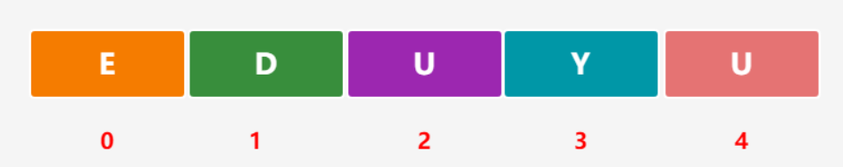


数组的优点：

1. 访问速度快：由于数组是顺序存储的，可以通过索引直接访问数组中的元素，时间复杂度为O(1)。
2. 易于实现：数组是一种简单的数据结构，容易实现和操作。

数组的缺点：

1. 大小固定：数组的大小是固定的，不能动态扩展。如果需要更多的存储空间，需要重新定义一个新的数组，这会增加额外的开销。
2. 空间利用率低：由于数组是连续的内存空间，即使某些位置没有被使用，也不能被其他数据结构使用，导致空间利用率较低。


#### 1.1.2 队列

&emsp;&emsp;队列是一种特殊的数据结构，其特点是遵循先进先出（FIFO）的原则。队列中的元素只能从一端（称为队尾）添加，而从另一端（称为队头）删除。

队列的特点如下：

1. 先进先出：队列中的元素遵循先进先出的原则，即最早进入队列的元素最先被删除。
2. 插入和删除操作发生在同端：队列中的插入操作发生在队尾，删除操作发生在队头。
3. 无界队列：队列的长度可以是任意的整数，只要内存空间足够。

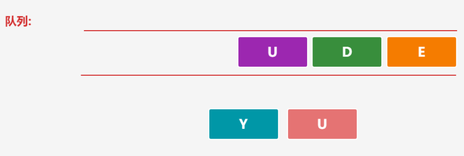

数据结构演示地址：https://www.cs.usfca.edu/~galles/visualization/Algorithms.html

Java代码的具体实现

```java
public static void main(String[] args) {
    Queue<Integer> queue = new LinkedList<>();
    queue.offer(3);//尾插
    queue.offer(6);
    queue.offer(9);
    queue.offer(12);
    System.out.println(queue);
    System.out.println(queue.peek());//访问队列头元素
    System.out.println(queue);
    System.out.println(queue.poll());//删除队列头元素
    System.out.println(queue);
}
```


#### 1.1.3 链表

&emsp;&emsp;链表是一种常见的数据结构，它通过指针将一组零散的内存块串联在一起。链表中的每个内存块被称为节点，每个节点除了存储数据之外，还需要记录链上的下一个节点的地址。

链表的特点是：

1. 不需要连续的内存空间。
2. 有指针引用。
3. 插入、删除数据效率高，时间复杂度为O(1)级别（只需更改指针指向即可）；但是，随机访问效率低，时间复杂度O(n)级别（需要从链头至链尾进行遍历）。
4. 和数组相比，内存空间消耗更大，因为每个存储数据的节点都需要额外的空间存储后继指针。

链表包括`单向链表`、`双向链表`和`循环链表`等类型。其中，单向链表的节点只有一个后继指针next指向后面的节点；双向链表的节点除了有一个后继指针next指向后面的节点外，还有一个前驱指针prev指向前面的节点；循环链表与单向链表的唯一区别是尾节点的指针指向头节点，形成一个环。

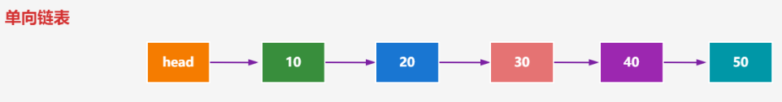


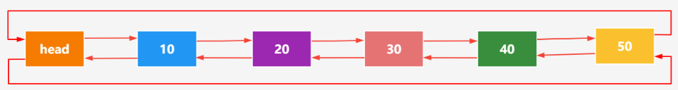


#### 1.1.4 栈

&emsp;&emsp;栈（Stack）是一种后进先出（LIFO）的数据结构，它只能在一端进行插入和删除操作，这一端被称为栈顶，另一端被称为栈底。栈的元素之间存在一种顺序关系，这种顺序关系由元素的插入和删除操作决定。

栈的主要操作有：

1. 入栈（push）：在栈顶添加一个元素。
2. 出栈（pop）：删除栈顶的元素并返回其值。
3. 判断栈空（is_empty）：检查栈是否为空。
4. 获取栈顶元素（top）：返回栈顶的元素值，但不删除它。


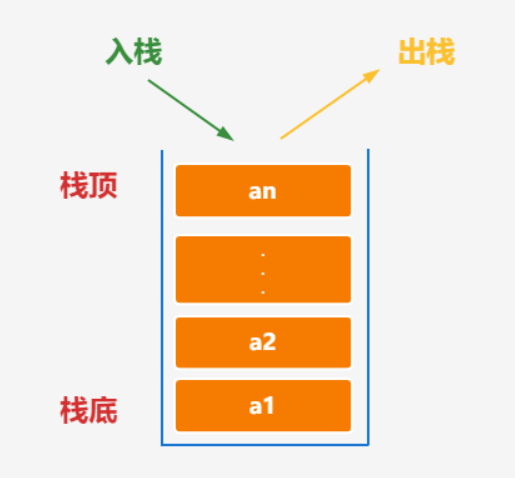


### 1.2 非线性结构

&emsp;&emsp;非线性表:与线性表对立，在非线性表之中，数据之间并不是简单的前后关系。非线性结构是一种相对复杂的数据结构，它不满足线性结构的数据元素之间的一对一关系。非线性结构包括图结构、树结构、二维数组、广义表、多维数组等。

&emsp;&emsp;在非线性结构中，数据元素之间存在多对多的关系，这种关系可以通过指针、引用等来实现。非线性结构可以用来表示复杂的数据关系，例如网络关系、图形关系等。

&emsp;&emsp;本课程中我们介绍下和Java关联性比较强的非线性结构-树

#### 1.2.1 树

`树`[Tree]是n（n>=0)个结点的有限集。n=0时称为空树。在任意一颗非空树中：

1. 有且仅有一个特定的称为根[Root]的结点；
2. 当n>1时，其余结点可分为m(m>0)个互不相交的有限集T1、T2、…、Tn，其中每一个集合本身又是一棵树，并且称为根的子树。

&emsp;&emsp;此外，树的定义还需要强调以下两点：

1. 根结点是唯一的，不可能存在多个根结点，数据结构中的树只能有一个根结点。
2. 子树的个数没有限制，但它们一定是互不相交的。

如图，是一棵普通树

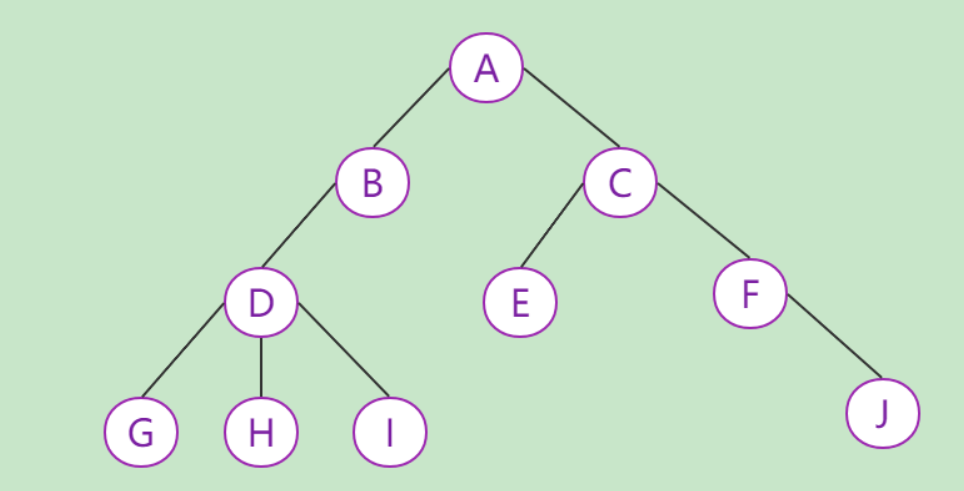

度数：结点拥有的子树数目称为结点的 **度** 。

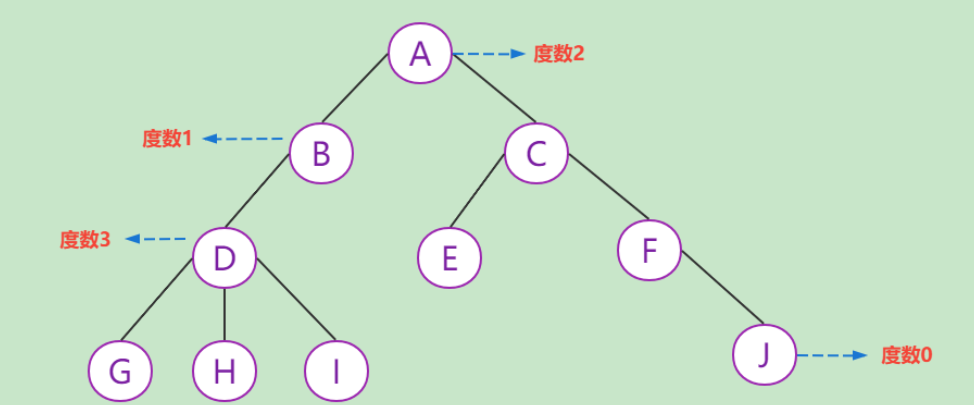

节点关系：

* 孩子结点
* 双亲结点
* 兄弟结点

节点层次：

&emsp;&emsp;从根开始定义起，根为第一层，根的孩子为第二层，以此类推。

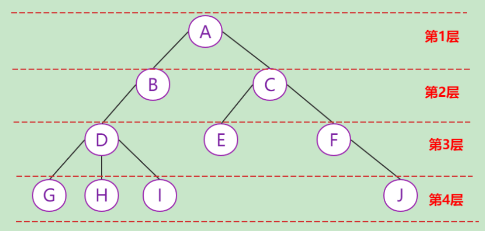

树的深度：树中结点的最大层次，如上图深度为4

根据不同的分类方式，树可以分为不同的类型：

1. 根据树分支的数量限制：可以分为二叉树和多叉树。二叉树最多只有两个子节点，而多叉树一个节点可以有多于两个的子节点。
2. 根据树节点的有序性：可以分为查找树和无序树。查找树的基本特征为任意一个节点所包含的键值，大于等于左孩子的键值，小于等于右孩子的键值。无序树则没有特定的键值大小关系。
3. 根据具体用途和特征：例如`红黑树`、`AVL树`、`平衡二叉树`、`平衡二叉搜索树`等。`红黑树`是一种自平衡二叉查找树，`AVL树`也是一种自平衡二叉查找树，它要求任何节点的两个子树的高度差最大为1。平衡二叉树和平衡二叉搜索树则是为了平衡树的左右子树的高度差。
4. 根据树的完整性和是否包含空值：可以分为完全二叉树、满二叉树、完全二叉搜索树、满二叉搜索树等。完全二叉树和满二叉树是包含所有节点的二叉树，而完全二叉搜索树和满二叉搜索树则是所有节点都按照一定顺序排列的二叉搜索树。


#### 1.2.2 二叉树

&emsp;&emsp;每个子节点只有两个节点的树，每个结点至多拥有两棵子树(即二叉树中不存在度大于2的结点)，并且，二叉树的子树有左右之分，其次序不能任意颠倒。

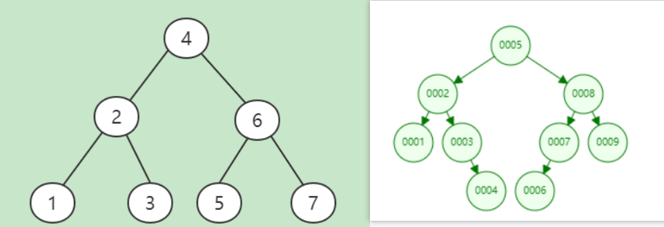

**二叉查找树**也称为有序二叉查找树,满足二叉查找树的一般性质,是指一棵树具有如下性质：

1. 任意节点左子树不为空,则左子树的值均小于根节点的值
2. 任意节点右子树不为空,则右子树的值均大于于根节点的值
3. 任意节点的左右子树也分别是二叉查找树
4. 没有键值相等的节点

二叉树又分为：

* 完美二叉树
* 完全二叉树
* 完满二叉树

完美二叉树：又称为 **满二叉树** ，除了叶子节点之外的每一个节点都有两个孩子节点，每层都被完全填充

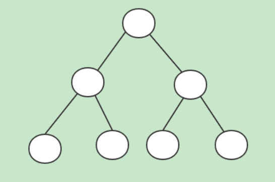

完全二叉树:除了最后一层之外的其他每一层都被完全填充，并且所有的节点都保持向左对齐


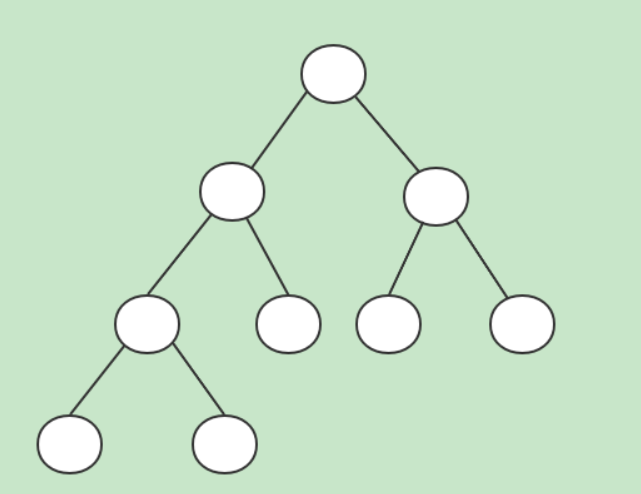

完满二叉树：除了叶子节点之外的每一个节点都有两个孩子节点。

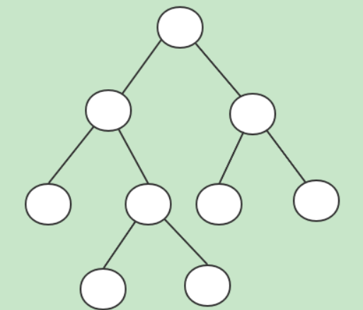

**二叉树的遍历操作**：

二叉树中的遍历规则有如下三种：

中序遍历：所谓的中序遍历就是先访问左节点，再访问根节点，最后访问右节点，即左-根-右遍历

先序遍历：所谓的前序遍历就是先访问根节点，再访问左节点，最后访问右节点，即根-左-右遍历(前序)

后序遍历：所谓的后序遍历就是先访问左节点，再访问右节点，最后访问根节点。即左-右-根遍历

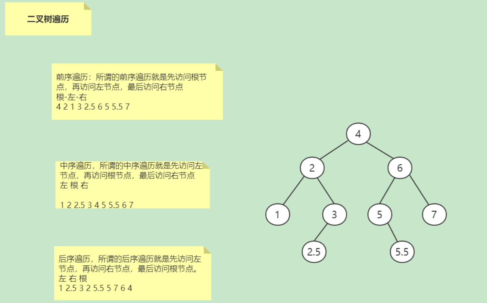

查找最小值：沿着根节点的左子树一路查找，直到最后一个不为空的节点，该节点就是当前这个树的最小节点

查找最大值：沿着根节点的右子树一路查找，直到最后一个不为空的节点，该节点就是当前这个树的最大节点

**查找前驱节点** ：小于当前节点的最大值

**查找后继节点** ：大于当前节点的最小值

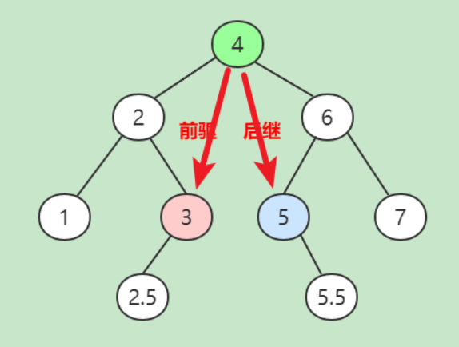

**二叉树的删除操作：**

二叉树中的删除节点：本质上是找前驱节点或者后继节点来替代

* 叶子节点直接删除
* 只有一个子节点的用子节点替代(本质上就是找的前驱节点或者后继节点，左节点就是前驱节点，右节点就是后继节点)
* 有两个子节点的，需要找到替代节点(替代节点就是前驱节点或者后继节点)


**二叉树的查找的局限性：**

一个二叉查找树是由n个节点随机构成,所以，对于某些情况,二叉查找树会退化成一个有n个节点的线性链.如下图:

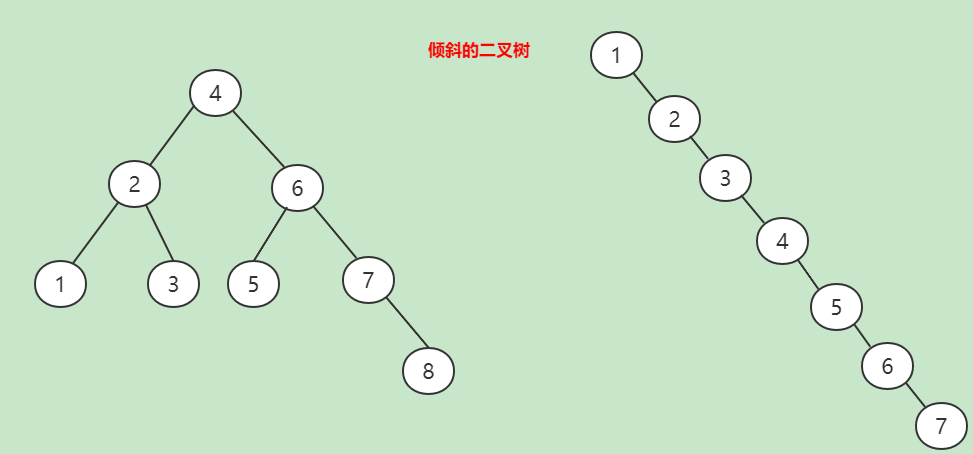

#### 1.2.3 AVL树

&emsp;&emsp;BST存在的问题是，树在插入的时候会导致倾斜，不同的插入顺序会导致数的高度不一样，而树的高度直接影响了树的查找效率。最坏的情况所有的节点都在一条斜线上，这样树的高度为N。基于BST存在的问题，平衡查找二叉树（Balanced BST）产生了。平衡树的插入和删除的时候，会通过旋转操作将高度保持在LogN。其中两款具有代表性的平衡术分别为AVL树（高度平衡树，具备二叉搜索树的全部特性，而且左右子树高度差不超过1）和红黑树。

  AVL树是如何实现平衡的呢？，具体是通过左旋或者右旋来实现的。具体如下图：

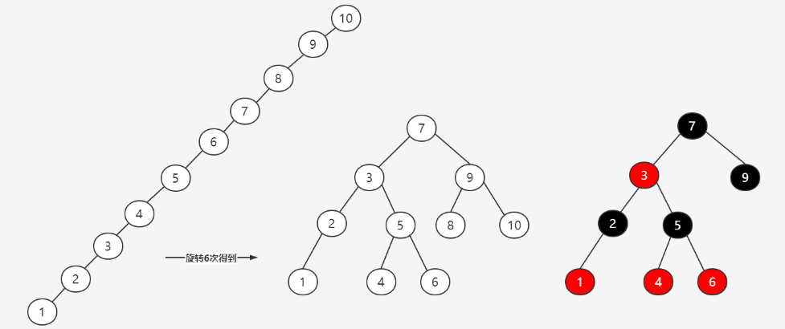

&emsp;&emsp;虽然AVL可以解决二叉树所存在的问题，但是AVL树要求太过严格，左旋和右旋的开销会比较大，这时出现了红黑树，只要求黑色节点平衡即可.

#### 1.2.4 2-3-4树

&emsp;&emsp;`2-3-4树`是四阶的 B树(Balance Tree)，他属于一种多路查找树，它的结构有以下限制：所有叶子节点都拥有相同的深度。节点只能是 2-节点、3-节点、4-节点之一。

- 2-节点：包含 1 个元素的节点，有 2 个子节点；
- 3-节点：包含 2 个元素的节点，有 3 个子节点；
- 4-节点：包含 3 个元素的节点，有 4 个子节点；


&emsp;&emsp;所有节点必须至少包含1个元素,元素始终保持排序顺序，整体上保持二叉查找树的性质，即父结点大于左子结点,小于右子结点；而且结点有多个元素时，每个元素必须大于它左边的和它的左子树中元素。

下图是一个典型的 2-3-4树:
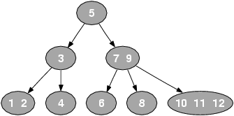


**生成的过程**
 &emsp;&emsp;接下来我们通过演示来看看2-3-4树生成的过程
第一次插入---2节点

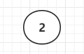


插入第二个节点--3节点 合并

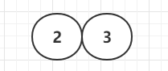

插入第三个节点---4节点 合并

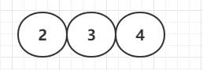

插入第4个节点---需要分裂

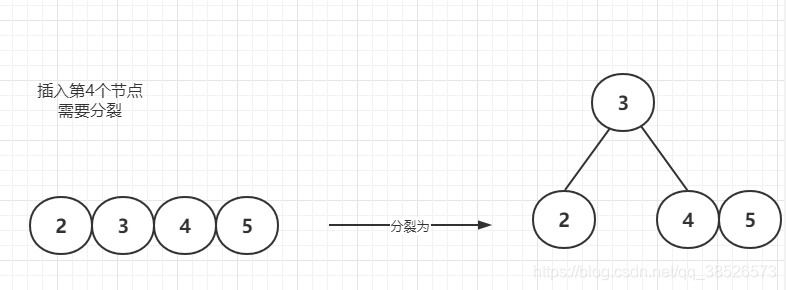

插入6

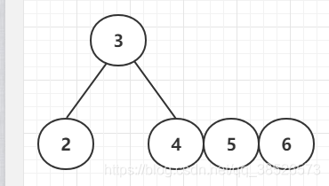

插入7

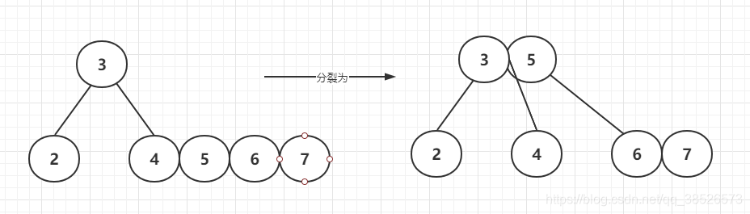

插入8

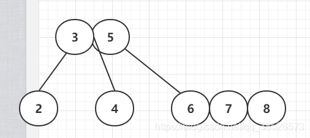

插入9

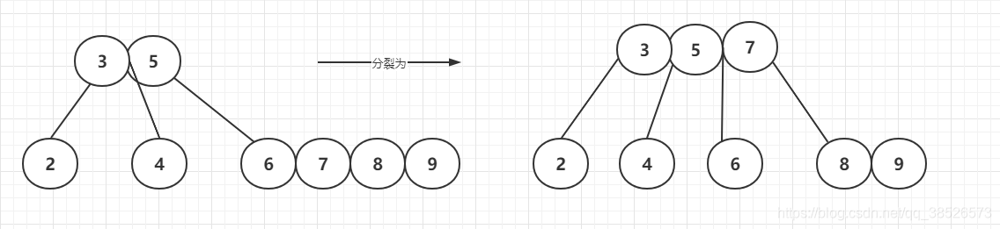

插入10

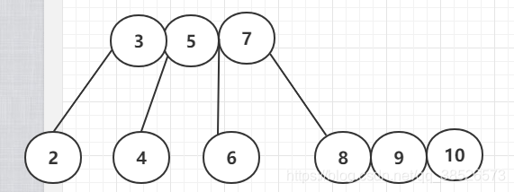

插入11

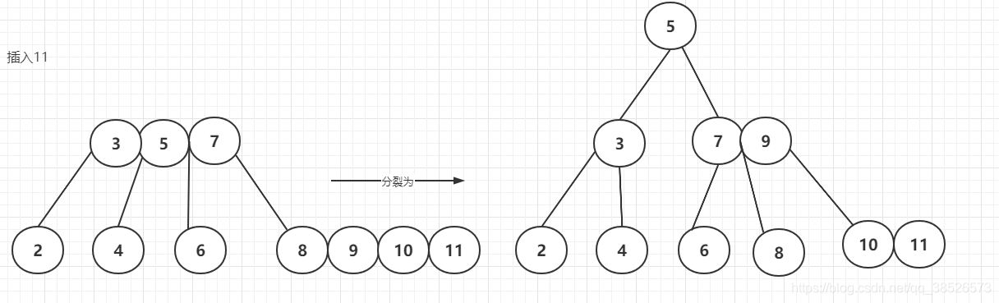

插入12

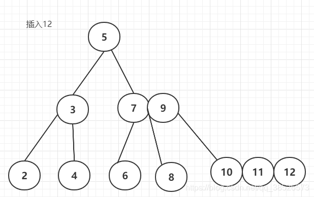

最后我们插入1来看看效果

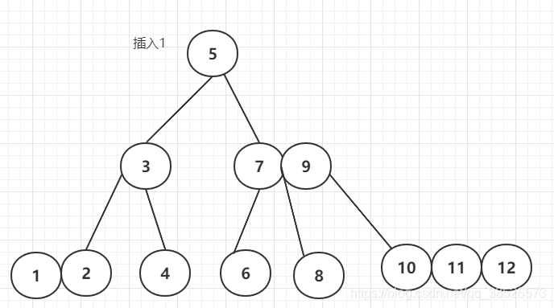


&emsp;&emsp;到这儿相信大家对于2-3-4树应该有了个直观的认知了。然后来看看`2-3-4树`和`红黑树`的对应关系。这个能帮助我们更好的理解红黑树.

&emsp;&emsp;红黑树起源于2-3-4树，它的本质就是2-3-4树。

`2节点`：一个2节点对应的红黑树节点就是一个黑色节点

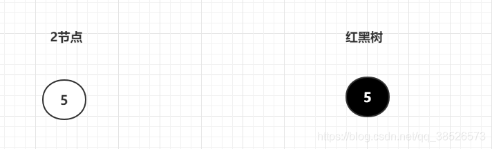

`3节点`:一个三节点可以有两种情况的红黑树节点，一种是右倾，一种是左倾，所以一个2-3-4树可以有多个红黑树

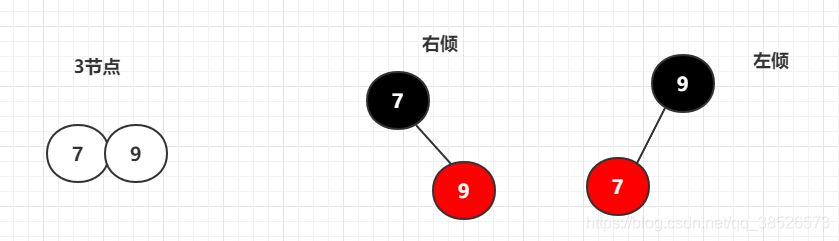

原则：上黑下红

`4节点`：一个四节点转换的情况只有一种，中间节点黑色，左右节点红色

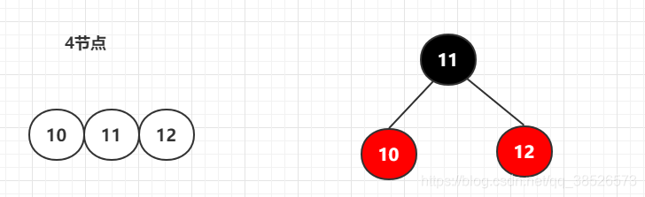


`裂变状态`：还有就是在2-3-4树中存在的裂变状态。转换为红黑树后会先变色(不能有两个相邻的红色节点)。

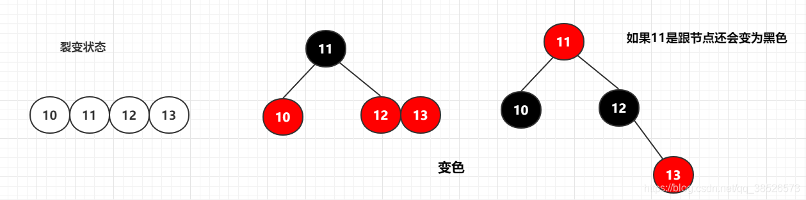


`转换为红黑树`：接下来具体看看一个2-3-4树是如何转换为对应的红黑树的，

原始的2-3-4树：

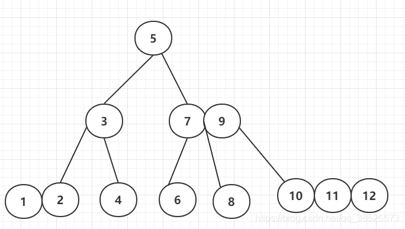

&emsp;&emsp;按照右倾规则来转换为：

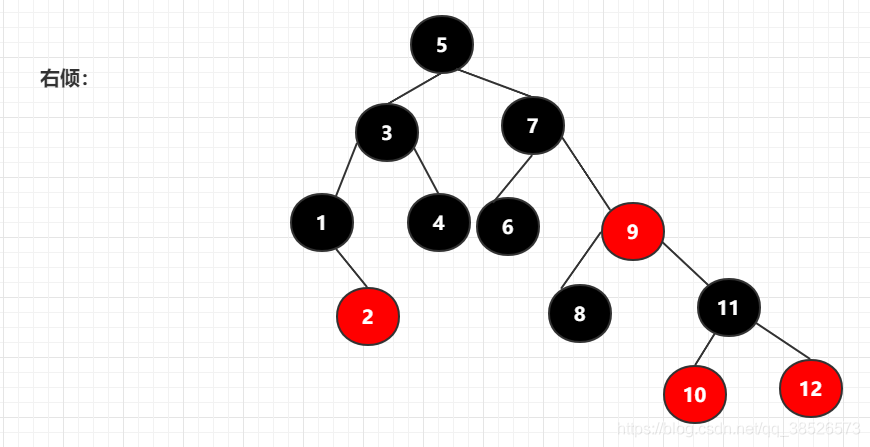

&emsp;&emsp;转换后满足黑色节点平衡的要求
&emsp;&emsp;按照左倾规则来转换为：

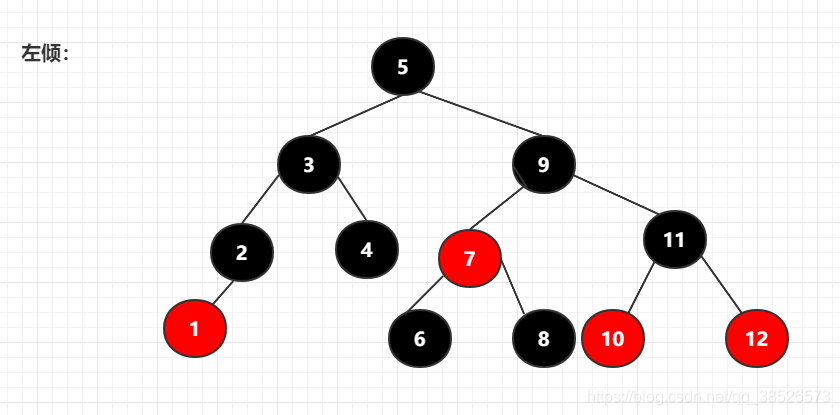

&emsp;&emsp;通过对2-3-4树和红黑树的等价关系，对于我们后面分析红黑树的内容会非常有帮助!!!

#### 1.2.5 红黑树

&emsp;&emsp;红黑树，Red-Black Tree 「RBT」是一个自平衡(不是绝对的平衡)的二叉查找树(BST)，树上的每个节点都遵循下面的规则:  

1. 每个节点要么是黑色，要么是红色。
2. 根节点是黑色。
3. 每个叶子节点（NIL）是黑色。
4. 每个红色结点的两个子结点一定都是黑色。 
5. 任意一结点到每个叶子结点的路径都包含数量相同的黑结点。

&emsp;&emsp;红黑树能自平衡，它靠的是什么？三种操作：左旋、右旋和变色

| 操作 | 描述                                                         |
| ---- | ------------------------------------------------------------ |
| 左旋 | 以某个结点作为支点(旋转结点)，其右子结点变为旋转结点的父结点，<br>右子结点的左子结点变为旋转结点的右子结点，左子结点保持不变。 |
| 右旋 | 以某个结点作为支点(旋转结点)，其左子结点变为旋转结点的父结点，<br/>左子结点的右子结点变为旋转结点的左子结点，右子结点保持不变。 |
| 变色 | 结点的颜色由红变黑或由黑变红。                               |

`旋转操作`

&emsp;&emsp;**左旋**：以某个节点作为旋转点，其右子节点变为旋转节点的父节点，右子节点的左子节点变为旋转节点的右子节点，左子节点保持不变。


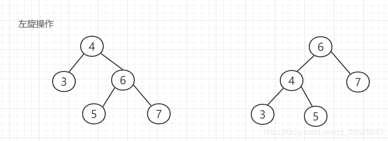

&emsp;&emsp;**右旋**：以某!个节点作为旋转点，其左子节点变为旋转节点的父节点，左子节点的右子节点变为旋转节点的左子节点，右子节点保持不变。


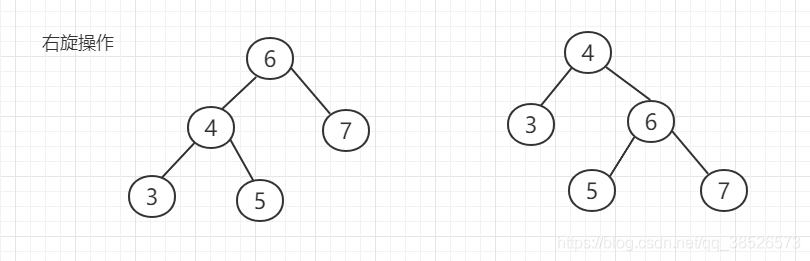

*Java代码实现旋转*：

&emsp;&emsp;先进行类结构定义

```java
package com.bobo.util.treemap;

public class BRTree {

    private static final boolean RED = false;
    private static final boolean BLACK = true;

    private RBNode root;

    public RBNode getRoot() {
        return root;
    }

    public void setRoot(RBNode root) {
        this.root = root;
    }


    /**
     * 表示 节点
     * @param <K>
     * @param <V>
     */
    static class RBNode<K extends Comparable<K>,V>{
        // 节点是双向的
        private RBNode parent;
        private RBNode left;
        private RBNode right;
        private boolean color;
        private K key;
        private V value;

        public RBNode() {
        }

        public RBNode(RBNode parent, RBNode left, RBNode right, boolean color, K key, V value) {
            this.parent = parent;
            this.left = left;
            this.right = right;
            this.color = color;
            this.key = key;
            this.value = value;
        }

        public RBNode getParent() {
            return parent;
        }

        public void setParent(RBNode parent) {
            this.parent = parent;
        }

        public RBNode getLeft() {
            return left;
        }

        public void setLeft(RBNode left) {
            this.left = left;
        }

        public RBNode getRight() {
            return right;
        }

        public void setRight(RBNode right) {
            this.right = right;
        }

        public boolean isColor() {
            return color;
        }

        public void setColor(boolean color) {
            this.color = color;
        }

        public K getKey() {
            return key;
        }

        public void setKey(K key) {
            this.key = key;
        }

        public V getValue() {
            return value;
        }

        public void setValue(V value) {
            this.value = value;
        }
    }
}

```


左旋代码实现

```java
    /**
     * 围绕p左旋
     *     p               pr(r)
     *    / |             / \
     *   pl  pr(r) =>    p   rr
     *      / \         / \
     *     rl  rr     pl  rl
     *
     *  左旋的时候
     *  p-pl 和 pr-rr的关系不变
     *  pr-rl 要变为 p-rl
     *      也就是 rl要变为 p的右子节点
     *      同时 p要成为 rl 的父节点
     *  还有就是要判断  p 是否有父节点
     *  如果没有
     *     r 变为 root 节点
     *  如果有
     *     r.parent = p.parent
     *     还要设置 r为 p.parent 的子节点(可能左也可能右)
     *     如果 p.parent.left == p
     *        p.parent.left = r;
     *     否则
     *        p.parent.right = r;
     *    最后
     *       p.parent = r;
     *       r.left = p;
     * @param p
     */
    private void leftRotate(RBNode p){
        if(p != null){
            RBNode r = p.right;
            // 1.设置 pr-rl 要变为 p-rl
            // 把rl设置到p的右子节点
            p.right = r.left;
            if(r.left != null){
                // 设置rl的父节点为p
                r.left.parent = p;
            }
            // 2.判断p的父节点情况
            r.parent = p.parent; // 不管 p是否有父节点，都把这个父节点设置为 r的父节点
            if(p.parent == null){
                root = r; // p没有父节点 则r为root节点
            }else if(p.parent.left == p){
                p.parent.left = r; // 如果p为 p.parent的左子节点 则 r 也为 p.parent的左子节点
            }else{
                p.parent.right = r; // 反之设置 r 为 p.parent的右子节点
            }
            // 最后 设置 p 为 r 的左子节点
            r.left = p;
            p.parent = r;
        }
    }
```

右旋实现：

```java
    /**
     * 围绕p右旋
     * @param p
     */
    public void rightRotate(RBNode p){
        if(p != null){
            RBNode r = p.left;
            p.left = r.right;
            if(r.right != null){
                r.right.parent = p;
            }
            r.parent = p.parent;
            if(p.parent == null){
                root = r;
            }else if(p.parent.left == p){
                p.parent.left = r;
            }else{
                p.parent.right = r;
            }
            r.right = p;
            p.parent = r;
        }
    }
```


`新增节点`:https://www.processon.com/view/link/60c21e25e401fd34a1514d25

&emsp;&emsp;2-3-4树中结点添加需要遵守以下规则：

- 插入都是向最下面一层插入
- 升元：将插入结点由 2-结点升级成 3-结点，或由 3-结点升级成 4-结点；
- 向 4-结点插入元素后，需要将中间元素提到父结点升元，原结点变成两个 2-结点，再把元素插入2-结点中，如果父结点也是 4-结点，则递归向上层升元，至到根结点后将树高加1；

&emsp;&emsp;而将这些规则对应到红黑树里，就是：

- 新插入的结点颜色为 红色 ，这样才可能不会对红黑树的高度产生影响。
- 2-结点对应红黑树中的单个黑色结点，插入时直接成功（对应 2-结点升元）。
- 3-结点对应红黑树中的 黑+红 子树，插入后将其修复成 红+黑+红 子树（对应 3-结点升元）；
- 4-结点对应红黑树中的 红+黑+红 子树，插入后将其修复成 红色祖父+黑色父叔+红色孩子 子树，然后再把祖父结点当成新插入的红色结点递归向上层修复，直至修复成功或遇到 root 结点；

&emsp;&emsp;公式：**红黑树**+新增一个节点（红色）**=**对等的2-3-4树+新增一个节点

**新增节点案例**

​	&emsp;&emsp;我们通过新增2-3-4树的过程来映射对应的红黑树的节点新增

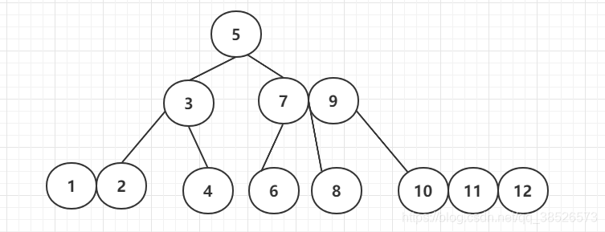

**1.新增一个节点，2 节点**

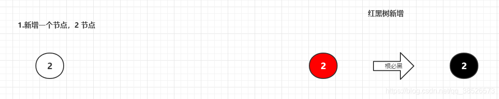

**2.新增一个节点，与2节点合并，直接合并**

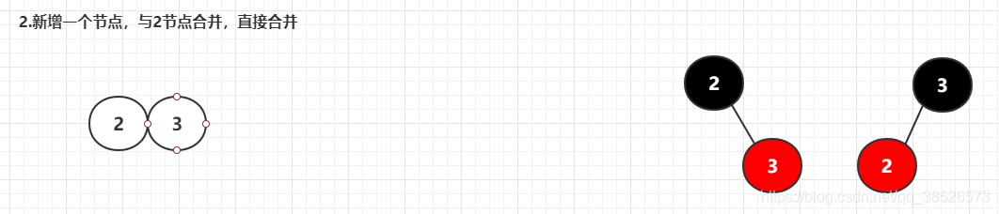


**3.新增一个节点，与3节点合并，直接合并**

插入的值的位置会有3种情况

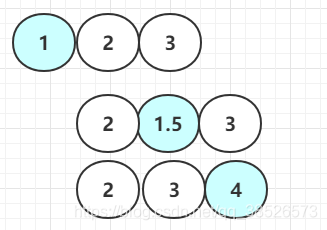

对应的红黑树为：

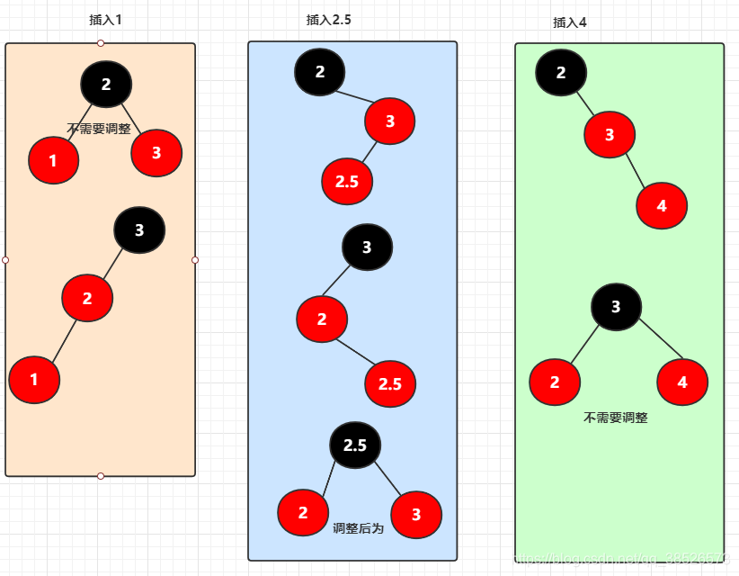

**4.新增一个节点，与4节点合并，此时需要分裂**

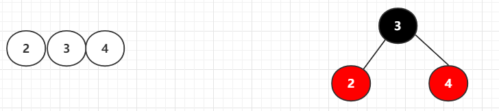

**插入值的位置可能是**

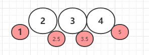

对应的红黑树的结构为：

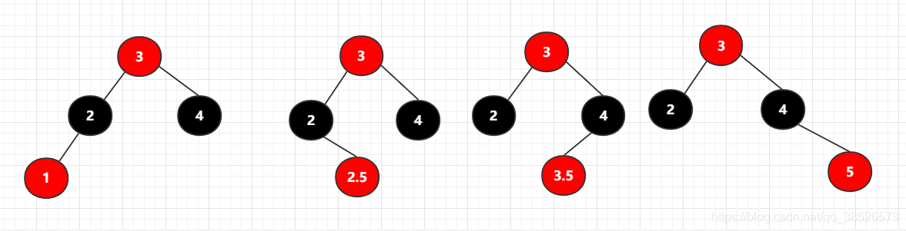

*新增代码实现*

&emsp;&emsp;红黑树的新增规则我们理清楚了，接下来就可以通过Java代码来具体的实现了。

先实现插入节点，这就是一个普通的二叉树的插入

```java
 /**
     * 新增节点
     * @param key
     * @param value
     */
    public void put(K key , V value){
        RBNode t = this.root;
        if(t == null){
            // 说明之前没有元素，现在插入的元素是第一个
            root = new RBNode<>(key , value == null ? key : value,null);
            return ;
        }
        int cmp ;
        // 寻找插入位置
        // 定义一个双亲指针
        RBNode parent;
        if(key == null){
            throw new NullPointerException();
        }
        // 沿着跟节点找插入位置
        do{
            parent = t;
            cmp = key.compareTo((K)t.key);
            if(cmp < 0){
                // 左侧找
                t = t.left;
            }else if(cmp > 0){
                // 右侧找
                t = t.right;
            }else{
                // 插入节点的值==比较的节点。值替换
                t.setValue(value==null?key:value);
                return;
            }
        }while (t != null);
        // 找到了插入的位置  parent指向 t 的父节点  t为null
        // 创建要插入的节点
        RBNode<K, Object> e = new RBNode<>(key, value == null ? key : value, parent);
        // 然后判断要插入的位置 是 parent的 左侧还是右侧
        if(cmp < 0){
            parent.left = e;
        }else{
            parent.right = e;
        }
        // 调整  变色 旋转
        fixAfterPut(e);
    }
```


然后再根据红黑树的特点来实现调整(旋转，变色)


```java
private boolean colorOf(RBNode node){
        return node == null ? BLACK:node.color;
    }

    private RBNode parentOf(RBNode node){
        return node != null ? node.parent:null;
    }

    private RBNode leftOf(RBNode node){
        return node != null ? node.left:null;
    }

    private RBNode rightOf(RBNode node){
        return node != null ? node.right:null;
    }

    private void setColor(RBNode node ,boolean color){
        if(node != null){
            node.setColor(color);
        }
    }

    /**
     * 插入节点后的调整处理
     * 1. 2-3-4树 新增元素 2节点添加一个元素将变为3节点 直接合并，节点中有两个元素
     *      红黑树：新增一个红色节点，这个红色节点会添加在黑色节点下(2节点) --- 这种情况不需要调整
     * 2. 2-3-4树 新增元素 3节点添加一个元素变为4节点合并 节点中有3个元素
     *      这里有6中情况，( 根左左 根左右  根右右 根右左)这四种要调整  (左中右的两种)不需要调整
     *      红黑树：新增红色节点 会添加到 上黑下红的节点中 = 排序后中间节点是黑色，两边节点是红色
     *
     *  3. 2-3-4树：新增一个元素 4节点添加一个元素需要裂变：中间元素升级为父节点，新增元素与剩下的其中一个合并
     *      红黑树：新增节点是红色+爷爷节点是黑色，父亲节点和叔叔节点为红色 调整为
     *              爷爷节点变红色，父亲和叔叔节点变为黑色，如果爷爷节点为root节点则调整为黑色
     * @param x
     */
    private void fixAfterPut(RBNode<K, Object> x) {
        x.color = RED;
        // 本质上就是父节点是黑色的就不需要调整，对应的 2 3的情况
        while(x != null && x != root && x.parent.color == RED){
            // 1. x 的父节点是爷爷的 左孩子
            if(parentOf(x) == parentOf(parentOf(x)).left){
                // 获取当前节点的叔叔节点
                RBNode y = rightOf(parentOf(parentOf(x)));
                // 情况3
                if(colorOf(y) == RED){
                    // 说明是 上3的情况  变色处理
                    // 父亲节点和叔叔节点设置为黑色
                    setColor(parentOf(x),BLACK);
                    setColor(y,BLACK);
                    // 爷爷节点设置为 红色
                    setColor(parentOf(parentOf(x)),RED);
                    // 递归处理
                    x = parentOf(parentOf(x));
                }else{
                    // 情况 2
                    if(x == parentOf(x).right){
                        // 如果x是父节点的右节点那么我们需要先根据 父节点 左旋
                        x = parentOf(x);
                        leftRotate(x);
                    }
                    // 叔叔节点为空  对应于 上面的情况2
                    // 将父节点变为黑色
                    setColor(parentOf(x),BLACK);
                    // 将爷爷节点变为红色
                    setColor(parentOf(parentOf(x)),RED);
                    // 右旋转  根据爷爷节点右旋转
                    rightRotate(parentOf(parentOf(x)));

                }
            }else{
                // x 的父节点是爷爷是右孩子
                // 获取父亲的叔叔节点
                RBNode y = leftOf(parentOf(parentOf(x)));
                if(colorOf(y) == RED){
                    // 情况3
                    setColor(parentOf(x),BLACK);
                    setColor(y,BLACK);
                    setColor(parentOf(parentOf(x)),RED);
                    x = parentOf(parentOf(x));
                }else{
                    // 情况2
                    if( x == parentOf(x).left){
                        x = parentOf(x);
                        rightRotate(x);
                    }
                    setColor(parentOf(x),BLACK);
                    setColor(parentOf(parentOf(x)),RED);
                    leftRotate(parentOf(parentOf(x)));
                }
            }
        }
        root.color = BLACK;
    }
```


**红黑树的删除操作：**

&emsp;&emsp;红黑树的节点的删除其实也分为两步：

1. 先删除节点(这步和普通的二叉树删除是一样的)
2. 然后再调整

&emsp;&emsp;要删除这个节点先需要找到这个节点，找到节点就是普通的二分查找，具体代码如下

```java
    private RBNode getNode(K key){
        RBNode node = this.root;
        while (node != null ){
            int cmp = key.compareTo((K) node.key);
            if(cmp < 0){
                // 在左子树
                node = node.left;
            }else if(cmp >0){
                // 右子树
                node = node.right;
            }else{
                return node;
            }
        }
        return null;
    }
```
&emsp;&emsp;在整理红黑树节点的删除操作时我们需要先理解清楚红黑树删除和2-3-4树删除的等价关系，这样理解起来才会比较容易
&emsp;&emsp;核心理论：红黑树删除操作的本质其实就是删除2-3-4树的叶子节点

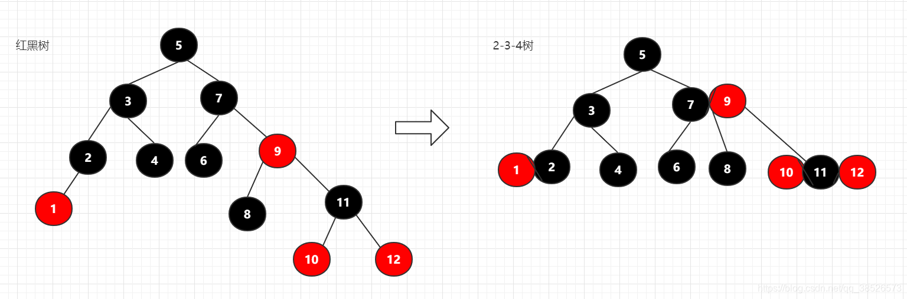

情况一

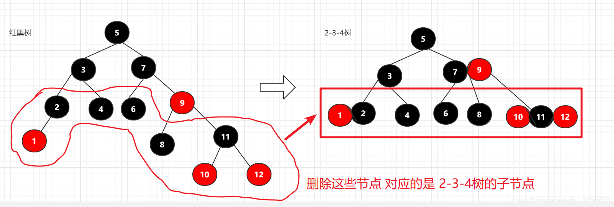

情况2：删除的是非情况1的节点，根据我们前面介绍的删除的规则，会找到对应的前驱和后继节点，那么最终删除的还是叶子节点

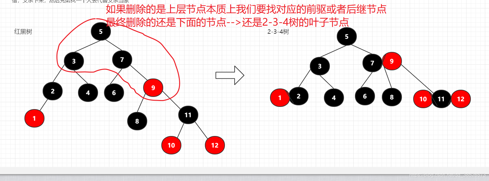

首先删除节点的代码为：
```java
/**
     * 删除节点
     * @param key
     * @return
     */
    public V remove(K key){
        // 先找到这个节点
        RBNode node = getNode(key);
        if(node == null){
            return null;
        }
        // 把值存起来 删除后 返回
        V oldValue = (V) node.value;
        deleteNode(node);
        return oldValue;
    }

    /**
     * 删除节点
     *   3种情况
     * 1.删除叶子节点，直接删除
     * 2.删除的节点有一个子节点，那么用子节点来替代
     * 3.如果删除的节点右两个子节点，此时需要找到前驱节点或者后继节点来替代
     *    可以转换为 1、2的情况
     * @param node
     */
    private void deleteNode(RBNode node){
        // 3.node节点有两个子节点
        if(node.left !=null && node.right != null){
            // 找到要删除节点的后继节点
            RBNode successor = successor(node);
            // 然后用后继节点的信息覆盖掉 要删除节点的信息
            node.key = successor.key;
            node.value = successor.value;
            // 然后我们要删除的节点就变为了 后继节点
            node = successor;
        }
        // 2.删除有一个子节点的情况
        RBNode replacement = node.left != null ? node.left : node.right;
        if(replacement != null){
            // 替代者的父指针指向原来 node 的父节点
            replacement.parent = node.parent;
            if(node.parent == null){
                // 说明 node 是root节点
                root = replacement;
            }else if(node == node.parent.left){
                // 双向绑定
                node.parent.left = replacement;
            }else{
                node.parent.right = replacement;
            }
            // 将node的左右孩子指针和父指针都指向null node等待GC
            node.left = node.right = node.parent = null;
            // 替换完成后需要调整平衡
            if(node.color == BLACK){
                // fixAfterRemove(replacement)
            }
        }else if(node.parent == null){
            // 说明要删除的是root节点
            root = null;
        }else{
            // 1. node节点是叶子节点 replacement为null
            // 先调整
            if(node.color == BLACK){
                // fixAfterRemove(node)
            }
            // 再删除
            if(node.parent != null){
                if(node == node.parent.left){
                    node.parent.left = null;
                }else{
                    node.parent.right = null;
                }
                node = null;
            }
        }
    }
```
然后就是需要调整红黑树的平衡了。

**删除后的平衡调整**

1.情况一：自己能搞定的，对应叶子节点是3节点和4节点

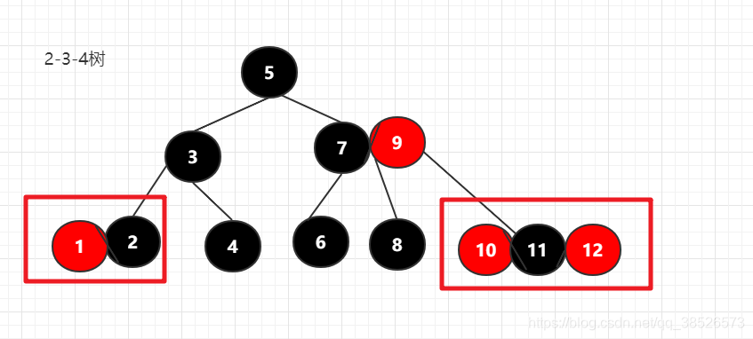

2.情况二：自己搞不定，需要兄弟借，但是兄弟不借，找父亲借，父亲下来，然后兄弟找一个人去代替父亲当家

这种情况就是兄弟节点是3节点或者4节点

找兄弟节点

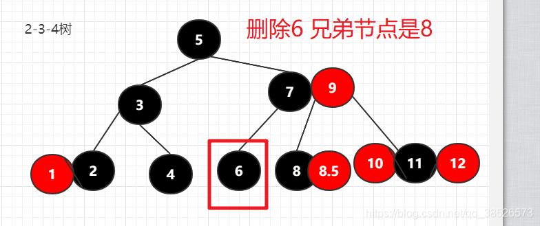

如果找到的兄弟节点是红色其实还要调整

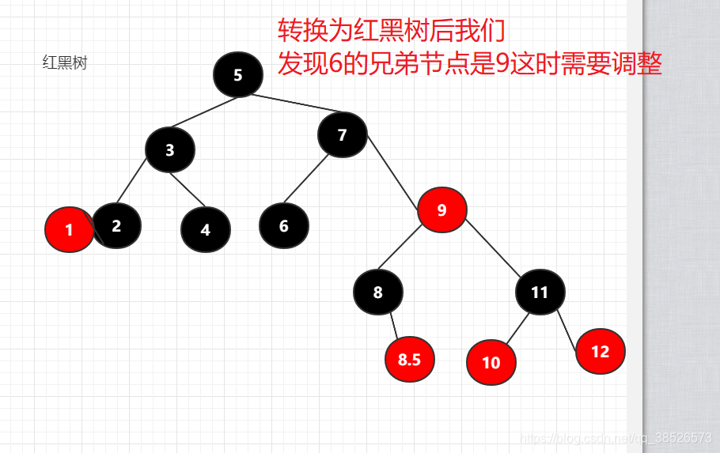

执行如下调整先,先变色，然后左旋

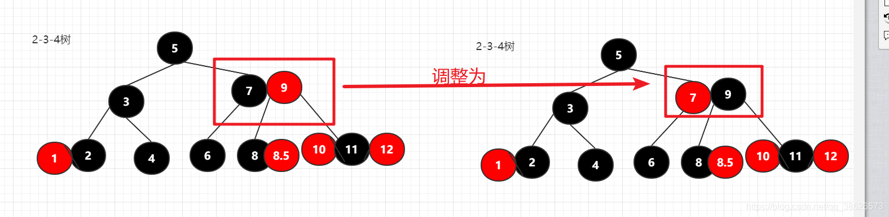

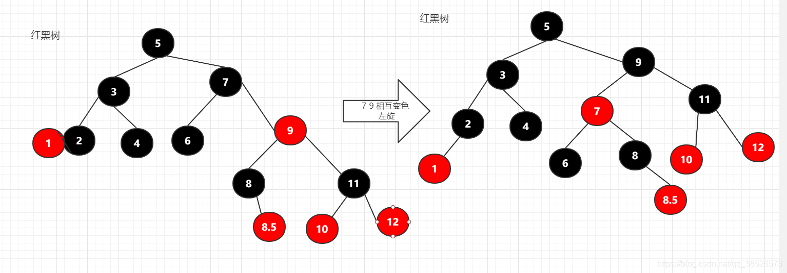

找兄弟节点借

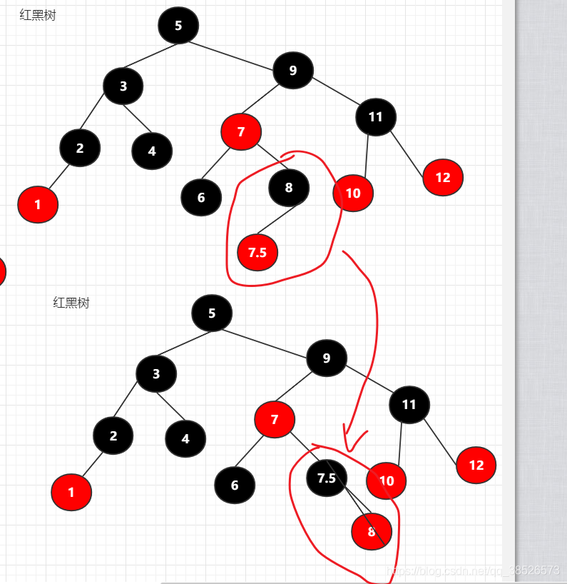

然后沿着7节点左旋

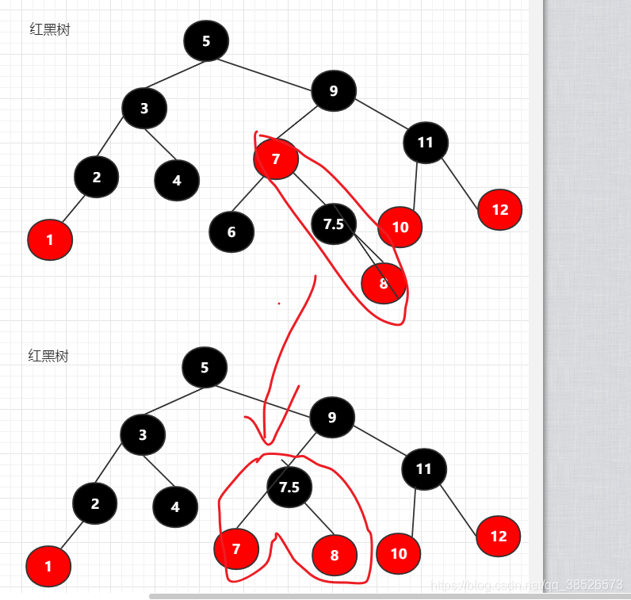

3.情况三：跟兄弟借，兄弟也没有（情同手足，同时自损）

兄弟节点是2节点，同时当前节点的父节点是红色节点的情况

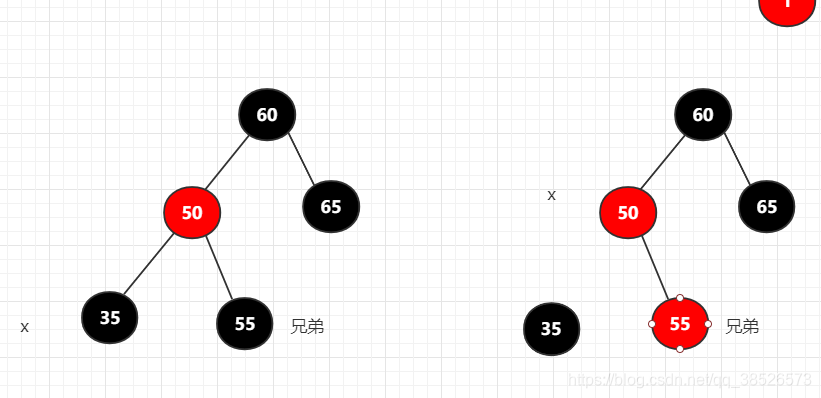

删除后直接变色就可以了

兄弟节点是2节点，同时当前节点的父节点是黑色节点

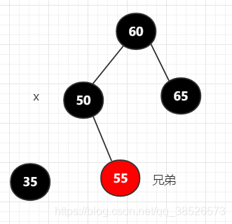

变更操作为如下，如果继续有父节点那么还要递归处理

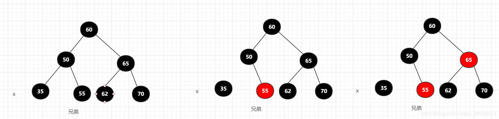

分析清楚了删除的3中情况，我们就可以撸处删除的调整的代码了
```java
    /**
     * 2-3-4树删除操作：
     * 1.情况一：自己能搞定的，对应叶子节点是3节点和4节点
     * 2.情况二：自己搞不定，需要兄弟借，但是兄弟不借，找父亲借，父亲下来，然后兄弟找一个人去代替父亲当家
     * 3.情况三：跟兄弟借，兄弟也没有
     * @param x
     */
    private void fixAfterRemove(RBNode x){
        // 情况2、3
        while(x != root && colorOf(x) == BLACK){
            // 这种情况才需要调整
            // x 是左孩子的情况
            if(x == leftOf(parentOf(x))){
                // 找兄弟节点
                RBNode rNode = rightOf(parentOf(x));
                // 判断此时的兄弟节点是否是真正的兄弟节点 兄弟是红色的情况要调整
                if(colorOf(rNode) == RED){ // 2-3-4树的 3节点 交换颜色，然后左旋一次就可以了
                    setColor(rNode,BLACK);
                    setColor(parentOf(x),RED);
                    leftRotate(parentOf(x)); // 左旋一次
                    rNode = rightOf(parentOf(x)); // 找到真正的兄弟节点
                }
                // 情况3 找兄弟借 没得借
                if(colorOf(leftOf(rNode)) == BLACK && colorOf(rightOf(rNode)) == BLACK){
                    // 情况复杂
                    setColor(rNode,RED);
                    x=parentOf(x); // 向上递归
                }else{
                    // 情况2 找兄弟借 有借
                    // 兄弟节点是 3节点或者4节点
                    if(colorOf(rightOf(rNode)) == BLACK){
                        // 右孩子为空，则左孩子肯定不为空
                        // 兄弟节点 先要左一次右旋
                        setColor(rNode,RED);
                        setColor(leftOf(rNode),BLACK);
                        rightRotate(rNode);
                        // 重新调整叔叔节点的位置
                        rNode = rightOf(parentOf(x));
                    }
                    // 变色  兄弟节点是 3节点还是4节点 都旋转一次
                    setColor(rNode, colorOf(parentOf(x)));
                    setColor(parentOf(x),BLACK);
                    setColor(rightOf(rNode),BLACK);
                    // 左旋
                    leftRotate(parentOf(x));
                    x = root; // 结束循环  递归 针对的是 情况3
                }
            }else{
                // 找兄弟节点
                RBNode rNode = leftOf(parentOf(x));
                // 判断此时的兄弟节点是否是真正的兄弟节点 兄弟是红色的情况要调整
                if(colorOf(rNode) == RED){ // 2-3-4树的 3节点 交换颜色，然后左旋一次就可以了
                    setColor(rNode,BLACK);
                    setColor(parentOf(x),RED);
                    rightRotate(parentOf(x)); // 左旋一次
                    rNode = leftOf(parentOf(x)); // 找到真正的兄弟节点
                }
                // 情况3 找兄弟借 没得借
                if(colorOf(rightOf(rNode)) == BLACK && colorOf(leftOf(rNode)) == BLACK){
                    // 情况复杂
                    setColor(rNode,RED);
                    x=parentOf(x); // 向上递归
                }else{
                    // 情况2 找兄弟借 有借
                    // 兄弟节点是 3节点或者4节点
                    if(colorOf(leftOf(rNode)) == BLACK){
                        // 右孩子为空，则左孩子肯定不为空
                        // 兄弟节点 先要左一次右旋
                        setColor(rNode,RED);
                        setColor(leftOf(rNode),BLACK);
                        leftRotate(rNode);
                        // 重新调整叔叔节点的位置
                        rNode = leftOf(parentOf(x));
                    }
                    // 变色  兄弟节点是 3节点还是4节点 都旋转一次
                    setColor(rNode, colorOf(parentOf(x)));
                    setColor(parentOf(x),BLACK);
                    setColor(leftOf(rNode),BLACK);
                    // 左旋
                    rightRotate(parentOf(x));
                    x = root; // 结束循环  递归 针对的是 情况3
                }
            }
        }
        // 情况1：替代节点是红色，直接染黑  在情况3的情况下  补偿删除的黑色节点，这样红黑树依然保存平衡
        setColor(x,BLACK);
    }
```

好了。红黑树的内容大家应该搞清楚了。同时TreeMap的代码大家也搞清楚了。你可以看看TreeMap的代码其实和我们上面写的代码是一样的

#### 1.2.6 B树

&emsp;&emsp;`B 树`（Balanced Tree）这个就是我们的多路平衡查找树，叫做B-Tree（B代表平衡）。跟AVL树一样，B树在枝节点和叶子节点存储键值、数据地址、节点引用。
&emsp;&emsp;它有一个特点：分叉数（路数）永远比关键字数多1。比如我们画的这棵树，每个节点存储两个关键字，那么就会有三个指针指向三个子节点。

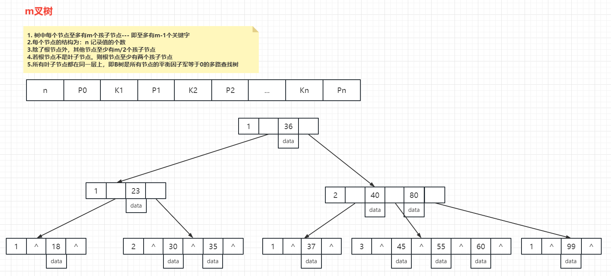

B Tree的查找规则是什么样的呢？
&emsp;&emsp;比如我们要在这张表里面查找30。
&emsp;&emsp;因为30小于36，走左边。
&emsp;&emsp;因为30大于23，走右边。
&emsp;&emsp;在磁盘块7里面就找到了30，只用了3次IO。

这个效率会比AVL树的效率更高

#### 1.2.7 B+树

&emsp;&emsp;加强版多路平衡查找树
&emsp;&emsp;因为B Tree的这种特性非常适合用于做索引的数据结构，所以很多文件系统和数据库的索引都是基于B Tree的。
&emsp;&emsp;但是实际上，MySQL里面使用的是B Tree的改良版本，叫做B+Tree（加强版多路平衡查找树）。

B+树的存储结构：

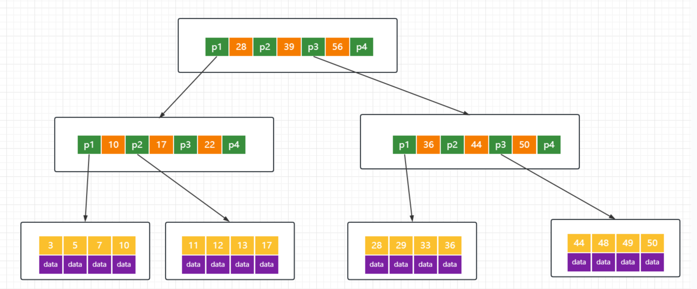

MySQL中的B+Tree有几个特点：

1. 它的关键字的数量是跟路数相等的；
2. B+Tree的根节点和枝节点中都不会存储数据，只有叶子节点才存储数据。InnoDB 中 B+ 树深度一般为 1-3 层，它就能满足千万级的数据存储。搜索到关键字不会直接返回，会到最后一层的叶子节点。比如我们搜索id=28，虽然在第一层直接命中了，但是全部的数据在叶子节点上面，所以我还要继续往下搜索，一直到叶子节点。
3. B+Tree的每个叶子节点增加了一个指向相邻叶子节点的指针，它的最后一个数据会指向下一个叶子节点的第一个数据，形成了一个有序链表的结构。

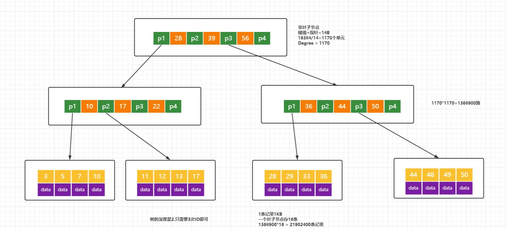

总结一下， B+Tree的特点带来的优势：

1. 它是B Tree的变种，B Tree能解决的问题，它都能解决。B Tree解决的两大问题是什么？（每个节点存储更多关键字；路数更多）
2. 扫库、扫表能力更强（如果我们要对表进行全表扫描，只需要遍历叶子节点就可以了，不需要遍历整棵B+Tree拿到所有的数据）
3. B+Tree的磁盘读写能力相对于B Tree来说更强（根节点和枝节点不保存数据区，所以一个节点可以保存更多的关键字，一次磁盘加载的关键字更多）
4. 排序能力更强（因为叶子节点上有下一个数据区的指针，数据形成了链表）
5. 效率更加稳定（B+Tree永远是在叶子节点拿到数据，所以IO次数是稳定的）


## 2.算法

&emsp;&emsp;看完了基本的数据结构后我们还需要看看常用的一些算法。数据结构加算法就等于程序。

### 2.1 排序

&emsp;&emsp;用于将一组数据按照特定的规则进行排序。排序算法可以分为内部排序和外部排序两种。

1. 内部排序算法：
   - 冒泡排序（Bubble Sort）：重复比较相邻的两个元素，如果顺序错误就交换位置，直到整个序列有序。
   - 插入排序（Insertion Sort）：将待排序的元素插入已经排好序的序列中的正确位置，直到整个序列有序。
   - 选择排序（Selection Sort）：每次从待排序序列中选择最小（或最大）的元素放到已排序序列的末尾，直到整个序列有序。
   - 快速排序（Quick Sort）：选择一个基准元素，将比基准元素小的元素放在基准元素的左边，比基准元素大的元素放在基准元素的右边，然后递归地对左右两个子序列进行快速排序。
   - 归并排序（Merge Sort）：将待排序序列划分为两个子序列，分别对两个子序列进行归并排序，然后将排序好的两个子序列合并成一个有序序列。
   - 堆排序（Heap Sort）：将待排序序列构建成一个最大堆（或最小堆），然后依次取出堆顶元素，再对剩余元素进行堆调整，直到整个序列有序。

2. 外部排序算法：
   - 多路归并排序：将待排序的数据分为多个有序的子序列，然后通过多次归并操作将这些子序列合并为一个有序序列。
   - 基于置换的排序：通过多次置换操作将待排序的数据重新排列成有序的序列。
   - 多层归并排序：将待排序的数据分成多个层次，每个层次都进行归并排序操作，最终得到一个有序序列。

不同的排序算法在时间复杂度、空间复杂度和稳定性等方面有所差异，选择合适的排序算法取决于具体的应用场景和数据规模。


### 2.2 查找

查找算法，也称为搜索算法，是一种用于在数据集中查找特定元素的算法。查找算法可以应用于各种数据结构，如数组、链表、树等。

常用的查找算法包括：

1. 线性查找：顺序遍历数据集，逐个比较元素，直到找到目标元素或遍历完整个数据集。时间复杂度为O(n)，其中n为数据集的大小。

2. 二分查找：仅适用于已经排序的数据集。从数据集的中间元素开始比较，如果目标元素小于中间元素，则在左半部分继续查找；如果目标元素大于中间元素，则在右半部分继续查找；如果目标元素等于中间元素，则找到目标元素。时间复杂度为O(log n)。

3. 哈希查找：通过哈希函数将目标元素映射到一个位置，然后在该位置进行查找。哈希查找的平均时间复杂度为O(1)，但是在处理哈希冲突时可能需要线性查找。

4. 二叉查找树：将数据集构建成二叉查找树，其中每个节点的左子树的值小于节点的值，右子树的值大于节点的值。通过比较目标元素和节点的值，可以在二叉查找树中进行快速查找。

5. 平衡二叉查找树：在二叉查找树的基础上，通过旋转操作保持树的平衡，以提高查找效率。常用的平衡二叉查找树有红黑树、AVL树等。

6. B树和B+树：适用于大规模数据的查找，将数据集分散存储在多个节点中，通过多级索引进行查找。B树和B+树的高度较小，能够减少磁盘I/O操作，提高查找效率。

7. 字符串匹配算法：用于在文本中查找特定的字符串。常用的字符串匹配算法有暴力匹配算法、KMP算法、Boyer-Moore算法等。


# 二、HashMap源码

## 1. 设计原理

&emsp;&emsp;HashMap 基于哈希表的 Map 接口实现，是以 key-value 存储形式存在，即主要用来存放键值对。HashMap 的实现不是同步的，这意味着它不是线程安全的。它的 key、value 都可以为 null，此外，HashMap 中的映射不是有序的。

&emsp;&emsp;jdk1.8 之前 HashMap 由 `数组 + 链表 `组成，数组是 HashMap 的主体，链表则是主要为了解决哈希冲突（两个对象调用的 hashCode 方法计算的哈希值经哈希函数算出来的地址被别的元素占用）而存在的（“拉链法”解决冲突）。jdk1.8 以后在解决哈希冲突时有了较大的变化，当链表长度大于阈值（或者红黑树的边界值，默认为 8 ）并且当前数组的长度大于 64 时，此时此索引位置上的所有数据改为使用`红黑树`存储。

**补充**：将链表转换成红黑树前会判断，即便阈值大于 8，但是数组长度小于 64，此时并不会将链表变为红黑树，而是选择逬行数组扩容。

&emsp;&emsp;这样做的目的是因为数组比较小，尽量避开红黑树结构，这种情况下变为红黑树结构，反而会降低效率，因为红黑树需要逬行左旋，右旋，变色这些操作来保持平衡。同时数组长度小于64时，搜索时间相对要快些。所以结上所述为了提高性能和减少搜索时间，底层阈值大于8并且数组长度大于64时，链表才转换为红黑树，具体可以参考 treeifyBin() 方法。

&emsp;&emsp;当然虽然增了红黑树作为底层数据结构，结构变得复杂了，但是阈值大于 8 并且数组长度大于 64 时，链表转换为红黑树时，效率也变的更高效。

HashMap 特点：

1. 存储无序的。
2. 键和值位置都可以是 null，但是键位置只能存在一个 null。
3. 键位置是唯一的，是底层的数据结构控制的。
4. jdk1.8 前数据结构是链表+数组，jdk1.8 之后是链表+数组+红黑树。
5. 阈值（边界值）> 8 并且数组长度大于 64，才将链表转换为红黑树，变为红黑树的目的是为了高效的查询。

JDK1.7的结构

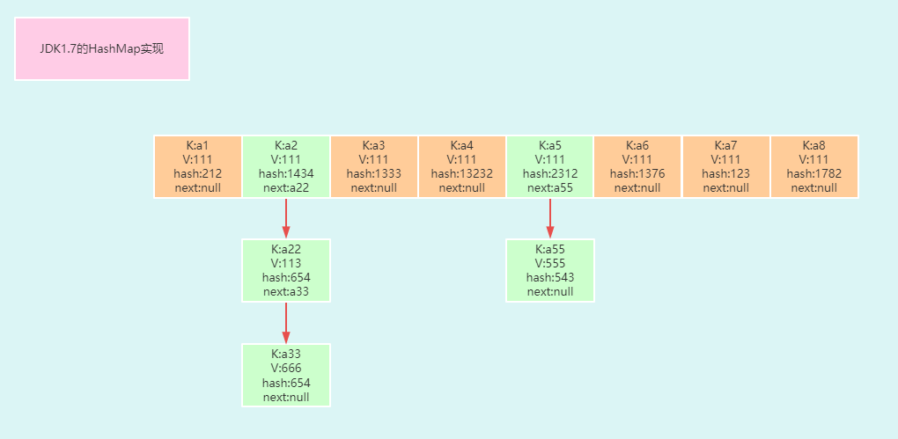

JDK1.8的结构

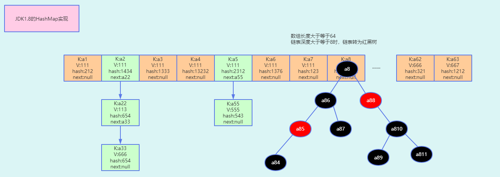

扩容的结构

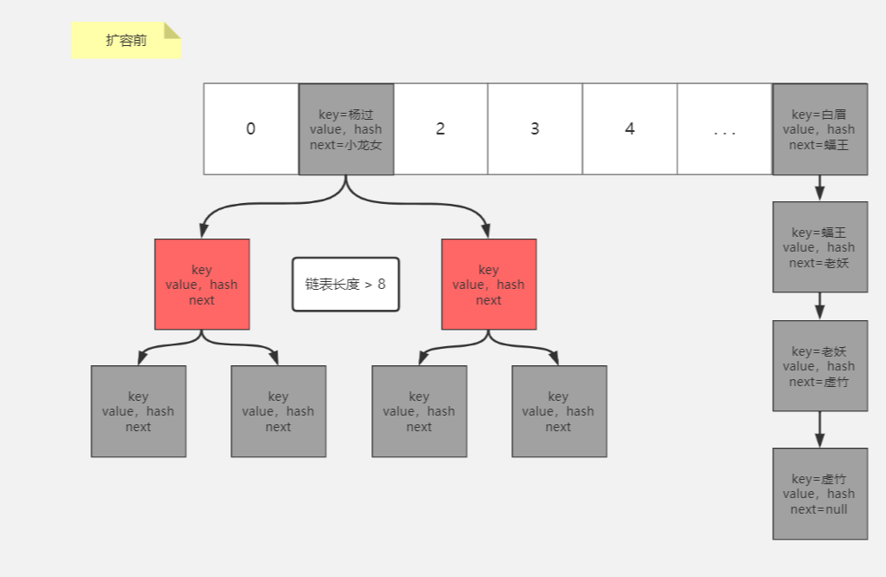

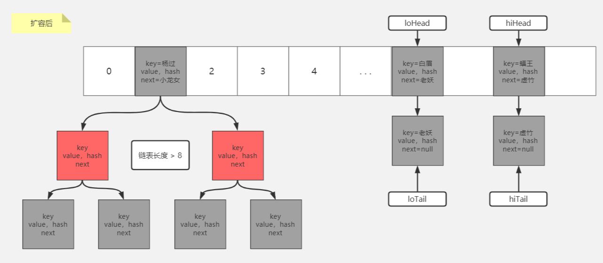


## 2.源码分析

### 2.1 成员变量

&emsp;&emsp;先来看看在HashMap中定义的相关成员变量

https://www.processon.com/view/link/654b410ccf851f1bbdc5f5ce

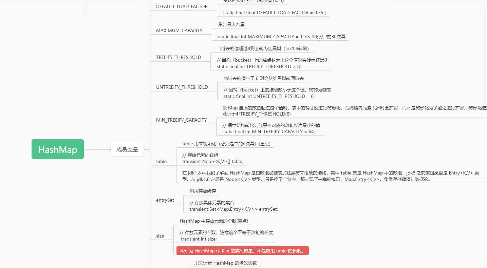


### 2.2 构造方法

&emsp;&emsp;然后来看看相关构造方法做了什么操作

**HashMap()**

构造一个空的HashMap，默认初始容量（16）和默认负载因子（0.75）

```java
public HashMap() {
    // 将默认的负载因子0.75赋值给loadFactor，并没有创建数组
   this.loadFactor = DEFAULT_LOAD_FACTOR; 
}
```

**HashMap(int initialCapacity)**

构造一个具有指定的初始容量和默认负载因子（0.75）HashMap 。

```java
 // 指定“容量大小”的构造函数
public HashMap(int initialCapacity) {
    this(initialCapacity, DEFAULT_LOAD_FACTOR);
}

```

**HashMap(int initialCapacity, float loadFactor)**

构造一个具有指定的初始容量和负载因子的 HashMap。

```java
/*
	 指定“容量大小”和“负载因子”的构造函数
	 initialCapacity：指定的容量
	 loadFactor:指定的负载因子
*/
public HashMap(int initialCapacity, float loadFactor) {
    	// 判断初始化容量initialCapacity是否小于0
        if (initialCapacity < 0)
            // 如果小于0，则抛出非法的参数异常IllegalArgumentException
            throw new IllegalArgumentException("Illegal initial capacity: " + initialCapacity);
    	// 判断初始化容量initialCapacity是否大于集合的最大容量MAXIMUM_CAPACITY
        if (initialCapacity > MAXIMUM_CAPACITY)
            // 如果超过MAXIMUM_CAPACITY，会将MAXIMUM_CAPACITY赋值给initialCapacity
            initialCapacity = MAXIMUM_CAPACITY;
    	// 判断负载因子loadFactor是否小于等于0或者是否是一个非数值
        if (loadFactor <= 0 || Float.isNaN(loadFactor))
            // 如果满足上述其中之一，则抛出非法的参数异常IllegalArgumentException
            throw new IllegalArgumentException("Illegal load factor: " + loadFactor);
     	// 将指定的负载因子赋值给HashMap成员变量的负载因子loadFactor
        this.loadFactor = loadFactor;
        this.threshold = tableSizeFor(initialCapacity);
    }
// 最后调用了tableSizeFor，来看一下方法实现：
     /*
     	返回比指定初始化容量大的最小的2的n次幂
     */
    static final int tableSizeFor(int cap) {
        int n = cap - 1;
        n |= n >>> 1;
        n |= n >>> 2;
        n |= n >>> 4;
        n |= n >>> 8;
        n |= n >>> 16;
        return (n < 0) ? 1 : (n >= MAXIMUM_CAPACITY) ? MAXIMUM_CAPACITY : n + 1;
    }

```

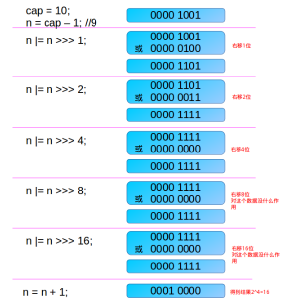

**HashMap(Map<? extends K, ? extends V> m)**

包含另一个 “Map” 的构造函数

```java
// 构造一个映射关系与指定 Map 相同的新 HashMap。
public HashMap(Map<? extends K, ? extends V> m) {
    	// 负载因子loadFactor变为默认的负载因子0.75
         this.loadFactor = DEFAULT_LOAD_FACTOR;
         putMapEntries(m, false);
 }
```

最后调用了 putMapEntries()，来看一下方法实现：

```java
final void putMapEntries(Map<? extends K, ? extends V> m, boolean evict) {
    //获取参数集合的长度
    int s = m.size();
    if (s > 0) {
        //判断参数集合的长度是否大于0，说明大于0
        if (table == null) { // 判断table是否已经初始化
                // 未初始化，s为m的实际元素个数
                float ft = ((float)s / loadFactor) + 1.0F;
                int t = ((ft < (float)MAXIMUM_CAPACITY) ? (int)ft : MAXIMUM_CAPACITY);
                // 计算得到的t大于阈值，则初始化阈值
                if (t > threshold)
                    threshold = tableSizeFor(t);
        }
        // 已初始化，并且m元素个数大于阈值，进行扩容处理
        else if (s > threshold)
            resize();
        // 将m中的所有元素添加至HashMap中
        for (Map.Entry<? extends K, ? extends V> e : m.entrySet()) {
            K key = e.getKey();
            V value = e.getValue();
            putVal(hash(key), key, value, false, evict);
        }
    }
}

```

注意：

float ft = ((float)s / loadFactor) + 1.0F; 这一行代码中为什么要加 1.0F ？

s/loadFactor 的结果是小数，加 1.0F 与 (int)ft 相当于是对小数做一个向上取整以尽可能的保证更大容量，更大的容量能够减少 resize 的调用次数。所以 + 1.0F 是为了获取更大的容量。

例如：原来集合的元素个数是 6 个，那么 6/0.75 是8，是 2 的n次幂，那么新的数组大小就是 8 了。然后原来数组的数据就会存储到长度是 8 的新的数组中了，这样会导致在存储元素的时候，容量不够，还得继续扩容，那么性能降低了，而如果 +1 呢，数组长度直接变为16了，这样可以减少数组的扩容。


### 2.3 put方法

put方法的实现文字说明：

1. 先通过 hash 值计算出 key 映射到哪个桶；
2. 如果桶上没有碰撞冲突，则直接插入；
3. 如果出现碰撞冲突了，则需要处理冲突：

   - a 如果该桶使用红黑树处理冲突，则调用红黑树的方法插入数据；
   - b 否则采用传统的链式方法插入。如果链的长度达到临界值，则把链转变为红黑树；
4. 如果桶中存在重复的键，则为该键替换新值 value；
5. 如果 size 大于阈值 threshold，则进行扩容；

图解过程：https://www.processon.com/view/link/654b42c1a0f05033c951e305


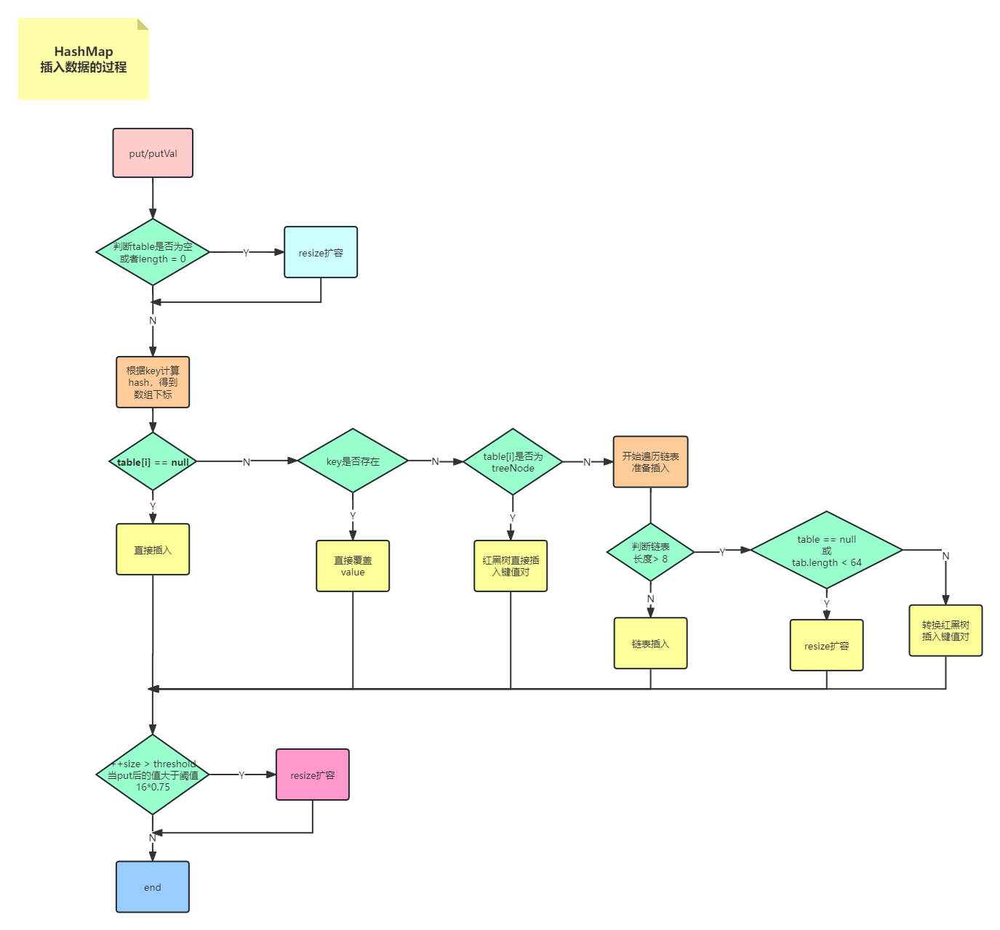


put方法的源码说明

```java
public V put(K key, V value) {
	return putVal(hash(key), key, value, false, true);
}
/**
 * hash：key 的 hash 值
 * key：原始 key
 * value：要存放的值
 * onlyIfAbsent：如果 true 代表不更改现有的值
 * evict：如果为false表示 table 为创建状态
 */
final V putVal(int hash, K key, V value, boolean onlyIfAbsent, boolean evict) {
    Node<K,V>[] tab; Node<K,V> p; int n, i;
    /*
    	1）transient Node<K,V>[] table; 表示存储Map集合中元素的数组。
    	2）(tab = table) == null 表示将空的table赋值给tab，然后判断tab是否等于null，第一次肯定是null。
    	3）(n = tab.length) == 0 表示将数组的长度0赋值给n，然后判断n是否等于0，n等于0，由于if判断使用双或，满足一个即可，则执行代码 n = (tab = resize()).length; 进行数组初始化，并将初始化好的数组长度赋值给n。
    	4）执行完n = (tab = resize()).length，数组tab每个空间都是null。
    */
    if ((tab = table) == null || (n = tab.length) == 0)
        n = (tab = resize()).length;
    /*
    	1）i = (n - 1) & hash 表示计算数组的索引赋值给i，即确定元素存放在哪个桶中。
    	2）p = tab[i = (n - 1) & hash]表示获取计算出的位置的数据赋值给结点p。
    	3) (p = tab[i = (n - 1) & hash]) == null 判断结点位置是否等于null，如果为null，则执行代码：tab[i] = newNode(hash, key, value, null);根据键值对创建新的结点放入该位置的桶中。
        小结：如果当前桶没有哈希碰撞冲突，则直接把键值对插入空间位置。
    */ 
    if ((p = tab[i = (n - 1) & hash]) == null)
        // 创建一个新的结点存入到桶中
        tab[i] = newNode(hash, key, value, null);
    else {
         // 执行else说明tab[i]不等于null，表示这个位置已经有值了
        Node<K,V> e; K k;
        /*
        	比较桶中第一个元素(数组中的结点)的hash值和key是否相等
        	1）p.hash == hash ：p.hash表示原来存在数据的hash值  hash表示后添加数据的hash值 比较两个hash值是否相等。
                 说明：p表示tab[i]，即 newNode(hash, key, value, null)方法返回的Node对象。
                    Node<K,V> newNode(int hash, K key, V value, Node<K,V> next) {
                        return new Node<>(hash, key, value, next);
                    }
                    而在Node类中具有成员变量hash用来记录着之前数据的hash值的。
             2）(k = p.key) == key ：p.key获取原来数据的key赋值给k  key 表示后添加数据的key比较两个key的地址值是否相等。
             3）key != null && key.equals(k)：能够执行到这里说明两个key的地址值不相等，那么先判断后添加的key是否等于null，如果不等于null再调用equals方法判断两个key的内容是否相等。
        */
        if (p.hash == hash &&
            ((k = p.key) == key || (key != null && key.equals(k))))
                /*
                	说明：两个元素哈希值相等，并且key的值也相等，将旧的元素整体对象赋值给e，用e来记录
                */ 
                e = p;
        // hash值不相等或者key不相等；判断p是否为红黑树结点
        else if (p instanceof TreeNode)
            // 放入树中
            e = ((TreeNode<K,V>)p).putTreeVal(this, tab, hash, key, value);
        // 说明是链表结点
        else {
            /*
            	1)如果是链表的话需要遍历到最后结点然后插入
            	2)采用循环遍历的方式，判断链表中是否有重复的key
            */
            for (int binCount = 0; ; ++binCount) {
                /*
                	1)e = p.next 获取p的下一个元素赋值给e。
                	2)(e = p.next) == null 判断p.next是否等于null，等于null，说明p没有下一个元素，那么此时到达了链表的尾部，还没有找到重复的key,则说明HashMap没有包含该键，将该键值对插入链表中。
                */
                if ((e = p.next) == null) {
                    /*
                    	1）创建一个新的结点插入到尾部
                    	 p.next = newNode(hash, key, value, null);
                    	 Node<K,V> newNode(int hash, K key, V value, Node<K,V> next) {
                                return new Node<>(hash, key, value, next);
                         }
                         注意第四个参数next是null，因为当前元素插入到链表末尾了，那么下一个结点肯定是null。
                         2）这种添加方式也满足链表数据结构的特点，每次向后添加新的元素。
                    */
                    p.next = newNode(hash, key, value, null);
                    /*
                    	1)结点添加完成之后判断此时结点个数是否大于TREEIFY_THRESHOLD临界值8，如果大于则将链表转换为红黑树。
                    	2）int binCount = 0 ：表示for循环的初始化值。从0开始计数。记录着遍历结点的个数。值是0表示第一个结点，1表示第二个结点。。。。7表示第八个结点，加上数组中的的一个元素，元素个数是9。
                    	TREEIFY_THRESHOLD - 1 --》8 - 1 ---》7
                    	如果binCount的值是7(加上数组中的的一个元素，元素个数是9)
                    	TREEIFY_THRESHOLD - 1也是7，此时转换红黑树。
                    */
                    if (binCount >= TREEIFY_THRESHOLD - 1) // -1 for 1st
                        // 转换为红黑树
                        treeifyBin(tab, hash);
                    // 跳出循环
                    break;
                }
   
                /*
                	执行到这里说明e = p.next 不是null，不是最后一个元素。继续判断链表中结点的key值与插入的元素的key值是否相等。
                */
                if (e.hash == hash &&
                    ((k = e.key) == key || (key != null && key.equals(k))))
                    // 相等，跳出循环
                    /*
                		要添加的元素和链表中的存在的元素的key相等了，则跳出for循环。不用再继续比较了
                		直接执行下面的if语句去替换去 if (e != null) 
                	*/
                    break;
                /*
                	说明新添加的元素和当前结点不相等，继续查找下一个结点。
                	用于遍历桶中的链表，与前面的e = p.next组合，可以遍历链表
                */
                p = e;
            }
        }
        /*
        	表示在桶中找到key值、hash值与插入元素相等的结点
        	也就是说通过上面的操作找到了重复的键，所以这里就是把该键的值变为新的值，并返回旧值
        	这里完成了put方法的修改功能
        */
        if (e != null) { 
            // 记录e的value
            V oldValue = e.value;
            // onlyIfAbsent为false或者旧值为null
            if (!onlyIfAbsent || oldValue == null)
                // 用新值替换旧值
                // e.value 表示旧值  value表示新值 
                e.value = value;
            // 访问后回调
            afterNodeAccess(e);
            // 返回旧值
            return oldValue;
        }
    }
    // 修改记录次数
    ++modCount;
    // 判断实际大小是否大于threshold阈值，如果超过则扩容
    if (++size > threshold)
        resize();
    // 插入后回调
    afterNodeInsertion(evict);
    return null;
}

```

上面的源码中使用到了hash方法，我们来看下hash方法的源码

```java
static final int hash(Object key) {
	int h;
	/*
	1）如果key等于null：返回的是0.
	2）如果key不等于null：首先计算出key的hashCode赋值给h，然后与h无符号右移16位后的
		二进制进行按位异或得到最后的hash值
	*/
	return (key == null) ? 0 : (h = key.hashCode()) ^ (h >>> 16);
}
```

从上面可以得知 HashMap 是支持 key 为空的，而 HashTable 是直接用 Key 来获取hashCode 所以 key 为空会抛异常。

(n - 1) & hash 的实现介绍：

- key.hashCode()；返回散列值也就是 hashcode，假设随便生成的一个值。
- n 表示数组初始化的长度是 16。
- &（按位与运算）：运算规则：相同的二进制数位上，都是 1 的时候，结果为 1，否则为0。
- ^（按位异或运算）：运算规则：相同的二进制数位上，数字相同，结果为 0，不同为 1。


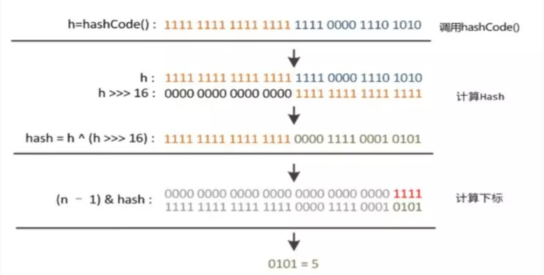


### 2.4 treeifyBin()方法

&emsp;&emsp;结点添加完成之后判断此时结点个数是否大于 TREEIFY_THRESHOLD 临界值 8，如果大于则将链表转换为红黑树，转换红黑树的方法 treeifyBin，整体代码如下：

```java
if (binCount >= TREEIFY_THRESHOLD - 1) // -1 for 1st
   //转换为红黑树 tab表示数组名  hash表示哈希值
   treeifyBin(tab, hash);

```

treeifyBin 方法如下所示

```java
/*
	替换指定哈希表的索引处桶中的所有链接结点，除非表太小，否则将修改大小。
	Node<K,V>[] tab = tab 数组名
	int hash = hash表示哈希值
*/
final void treeifyBin(Node<K,V>[] tab, int hash) {
    int n, index; Node<K,V> e;
    /*
    	如果当前数组为空或者数组的长度小于进行树形化的阈值(MIN_TREEIFY_CAPACITY = 64)，就去扩容。而不是将结点变为红黑树。
    	目的：如果数组很小，那么转换红黑树，然后遍历效率要低一些。这时进行扩容，那么重新计算哈希值，链表长度有可能就变短了，数据会放到数组中，这样相对来说效率高一些。
    */
    if (tab == null || (n = tab.length) < MIN_TREEIFY_CAPACITY)
        //扩容方法
        resize();
    else if ((e = tab[index = (n - 1) & hash]) != null) {
        /*
        	1）执行到这里说明哈希表中的数组长度大于阈值64，开始进行树形化
        	2）e = tab[index = (n - 1) & hash]表示将数组中的元素取出赋值给e，e是哈希表中指定位置桶里的链表结点，从第一个开始
        */
        // hd：红黑树的头结点   tl：红黑树的尾结点
        TreeNode<K,V> hd = null, tl = null;
        do {
            // 新创建一个树的结点，内容和当前链表结点e一致
            TreeNode<K,V> p = replacementTreeNode(e, null);
            if (tl == null)
                hd = p; // 将新创键的p结点赋值给红黑树的头结点
            else {
                p.prev = tl; // 将上一个结点p赋值给现在的p的前一个结点
                tl.next = p; // 将现在结点p作为树的尾结点的下一个结点
            }
            tl = p;
            /*
            	e = e.next 将当前结点的下一个结点赋值给e，如果下一个结点不等于null
            	则回到上面继续取出链表中结点转换为红黑树
            */
        } while ((e = e.next) != null);
        /*
        	让桶中的第一个元素即数组中的元素指向新建的红黑树的结点，以后这个桶里的元素就是红黑树
        	而不是链表数据结构了
        */
        if ((tab[index] = hd) != null)
            hd.treeify(tab);
    }
}

```

小结：

1. 根据哈希表中元素个数确定是扩容还是树形化。
2. 如果是树形化遍历桶中的元素，创建相同个数的树形结点，复制内容，建立起联系。
3. 然后让桶中的第一个元素指向新创建的树根结点，替换桶的链表内容为树形化内容。


### 2.5 扩容方法

扩容机制：

**什么时候才需要扩容**

&emsp;&emsp;当 HashMap 中的元素个数超过数组大小(数组长度)*loadFactor(负载因子)时，就会进行数组扩容，loadFactor 的默认值是 0.75。

**HashMap 的扩容是什么**

&emsp;&emsp;进行扩容，会伴随着一次重新 hash 分配，并且会遍历 hash 表中所有的元素，是非常耗时的。在编写程序中，要尽量避免 resize。HashMap 在进行扩容时，使用的 rehash 方式非常巧妙，因为每次扩容都是翻倍，与原来计算的 (n - 1) & hash 的结果相比，只是多了一个 bit 位，所以结点要么就在原来的位置，要么就被分配到 “原位置 + 旧容量” 这个位置。

例如我们从 16 扩展为 32 时，具体的变化如下所示：

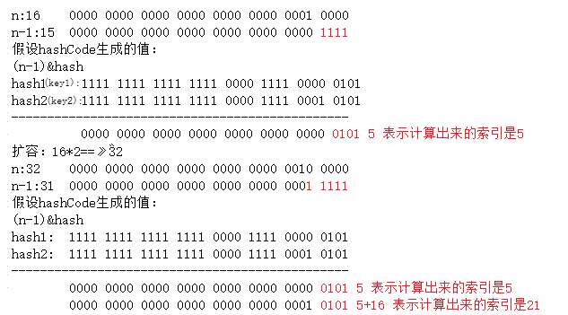

因此元素在重新计算 hash 之后，因为 n 变为 2 倍，那么 n - 1 的标记范围在高位多 1bit(红色)，因此新的 index 就会发生这样的变化。

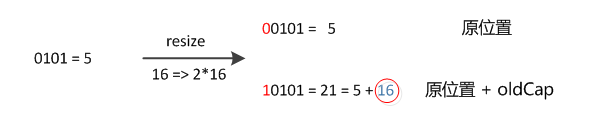

**说明：**

&emsp;&emsp;5 是假设计算出来的原来的索引。这样就验证了上述所描述的：扩容之后所以结点要么就在原来的位置，要么就被分配到 “原位置 + 旧容量” 这个位置。

&emsp;&emsp;因此，我们在扩充 HashMap 的时候，不需要重新计算 hash，只需要看看原来的 hash 值新增的那个 bit 是 1 还是 0 就可以了，是 0 的话索引没变，是 1 的话索引变成 “原位置 + 旧容量” 。可以看看下图为 16 扩充为 32 的 resize 示意图：

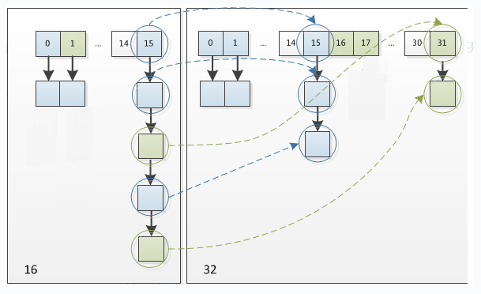

&emsp;&emsp;正是因为这样巧妙的 rehash 方式，既省去了重新计算 hash 值的时间，而且同时，由于新增的 1bit 是 0 还是 1 可以认为是随机的，在 resize 的过程中保证了 rehash 之后每个桶上的结点数一定小于等于原来桶上的结点数，保证了 rehash 之后不会出现更严重的 hash 冲突，均匀的把之前的冲突的结点分散到新的桶中了。

resize源码分析

```java
final Node<K,V>[] resize() {
    // 得到当前数组
    Node<K,V>[] oldTab = table;
    // 如果当前数组等于null长度返回0，否则返回当前数组的长度
    int oldCap = (oldTab == null) ? 0 : oldTab.length;
    //当前阀值点 默认是12(16*0.75)
    int oldThr = threshold;
    int newCap, newThr = 0;
    // 如果老的数组长度大于0
    // 开始计算扩容后的大小
    if (oldCap > 0) {
        // 超过最大值就不再扩充了，就只好随你碰撞去吧
        if (oldCap >= MAXIMUM_CAPACITY) {
            // 修改阈值为int的最大值
            threshold = Integer.MAX_VALUE;
            return oldTab;
        }
        /*
        	没超过最大值，就扩充为原来的2倍
        	1) (newCap = oldCap << 1) < MAXIMUM_CAPACITY 扩大到2倍之后容量要小于最大容量
        	2）oldCap >= DEFAULT_INITIAL_CAPACITY 原数组长度大于等于数组初始化长度16
        */
        else if ((newCap = oldCap << 1) < MAXIMUM_CAPACITY &&
                 oldCap >= DEFAULT_INITIAL_CAPACITY)
            // 阈值扩大一倍
            newThr = oldThr << 1; // double threshold
    }
    // 老阈值点大于0 直接赋值
    else if (oldThr > 0) // 老阈值赋值给新的数组长度
        newCap = oldThr;
    else { // 直接使用默认值
        newCap = DEFAULT_INITIAL_CAPACITY;//16
        newThr = (int)(DEFAULT_LOAD_FACTOR * DEFAULT_INITIAL_CAPACITY);
    }
    // 计算新的resize最大上限
    if (newThr == 0) {
        float ft = (float)newCap * loadFactor;
        newThr = (newCap < MAXIMUM_CAPACITY && ft < (float)MAXIMUM_CAPACITY ?
                  (int)ft : Integer.MAX_VALUE);
    }
    // 新的阀值 默认原来是12 乘以2之后变为24
    threshold = newThr;
    // 创建新的哈希表
    @SuppressWarnings({"rawtypes","unchecked"})
    //newCap是新的数组长度--》32
    Node<K,V>[] newTab = (Node<K,V>[])new Node[newCap];
    table = newTab;
    // 判断旧数组是否等于空
    if (oldTab != null) {
        // 把每个bucket都移动到新的buckets中
        // 遍历旧的哈希表的每个桶，重新计算桶里元素的新位置
        for (int j = 0; j < oldCap; ++j) {
            Node<K,V> e;
            if ((e = oldTab[j]) != null) {
                // 原来的数据赋值为null 便于GC回收
                oldTab[j] = null;
                // 判断数组是否有下一个引用
                if (e.next == null)
                    // 没有下一个引用，说明不是链表，当前桶上只有一个键值对，直接插入
                    newTab[e.hash & (newCap - 1)] = e;
                //判断是否是红黑树
                else if (e instanceof TreeNode)
                    // 说明是红黑树来处理冲突的，则调用相关方法把树分开
                    ((TreeNode<K,V>)e).split(this, newTab, j, oldCap);
                else { // 采用链表处理冲突
                    Node<K,V> loHead = null, loTail = null;
                    Node<K,V> hiHead = null, hiTail = null;
                    Node<K,V> next;
                    // 通过上述讲解的原理来计算结点的新位置
                    do {
                        // 原索引
                        next = e.next;
                     	// 这里来判断如果等于true e这个结点在resize之后不需要移动位置
                        if ((e.hash & oldCap) == 0) {
                            if (loTail == null)
                                loHead = e;
                            else
                                loTail.next = e;
                            loTail = e;
                        }
                        // 原索引+oldCap
                        else {
                            if (hiTail == null)
                                hiHead = e;
                            else
                                hiTail.next = e;
                            hiTail = e;
                        }
                    } while ((e = next) != null);
                    // 原索引放到bucket里
                    if (loTail != null) {
                        loTail.next = null;
                        newTab[j] = loHead;
                    }
                    // 原索引+oldCap放到bucket里
                    if (hiTail != null) {
                        hiTail.next = null;
                        newTab[j + oldCap] = hiHead;
                    }
                }
            }
        }
    }
    return newTab;
}


```


### 2.6 remove方法

&emsp;&emsp;删除方法就是首先先找到元素的位置，如果是链表就遍历链表找到元素之后删除。如果是用红黑树就遍历树然后找到之后做删除，树小于 6 的时候要转链表。

```java
// remove方法的具体实现在removeNode方法中，所以我们重点看下removeNode方法
public V remove(Object key) {
        Node<K,V> e;
        return (e = removeNode(hash(key), key, null, false, true)) == null ?
            null : e.value;
    }
```

removeNode() 方法：

```java
final Node<K,V> removeNode(int hash, Object key, Object value,
                           boolean matchValue, boolean movable) {
    Node<K,V>[] tab; Node<K,V> p; int n, index;
	// 根据hash找到位置 
	// 如果当前key映射到的桶不为空
    if ((tab = table) != null && (n = tab.length) > 0 &&
        (p = tab[index = (n - 1) & hash]) != null) {
        Node<K,V> node = null, e; K k; V v;
        // 如果桶上的结点就是要找的key，则将node指向该结点
        if (p.hash == hash &&
            ((k = p.key) == key || (key != null && key.equals(k))))
            node = p;
        else if ((e = p.next) != null) {
            // 说明结点存在下一个结点
            if (p instanceof TreeNode)
                // 说明是以红黑树来处理的冲突，则获取红黑树要删除的结点
                node = ((TreeNode<K,V>)p).getTreeNode(hash, key);
            else {
                // 判断是否以链表方式处理hash冲突，是的话则通过遍历链表来寻找要删除的结点
                do {
                    if (e.hash == hash &&
                        ((k = e.key) == key ||
                         (key != null && key.equals(k)))) {
                        node = e;
                        break;
                    }
                    p = e;
                } while ((e = e.next) != null);
            }
        }
        // 比较找到的key的value和要删除的是否匹配
        if (node != null && (!matchValue || (v = node.value) == value ||
                             (value != null && value.equals(v)))) {
            // 通过调用红黑树的方法来删除结点
            if (node instanceof TreeNode)
                ((TreeNode<K,V>)node).removeTreeNode(this, tab, movable);
            else if (node == p)
                // 链表删除
                tab[index] = node.next;
            else
                p.next = node.next;
            // 记录修改次数
            ++modCount;
            // 变动的数量
            --size;
            afterNodeRemoval(node);
            return node;
        }
    }
    return null;
}

```


### 2.7 get方法

&emsp;&emsp;查找方法，通过元素的 key 找到 value，这个方法就比较好理解了

```java
public V get(Object key) {
    Node<K,V> e;
    return (e = getNode(hash(key), key)) == null ? null : e.value;
}
```

get 方法主要调用的是 getNode 方法，代码如下：

```java
final Node<K,V> getNode(int hash, Object key) {
    Node<K,V>[] tab; Node<K,V> first, e; int n; K k;
    // 如果哈希表不为空并且key对应的桶上不为空
    if ((tab = table) != null && (n = tab.length) > 0 &&
        (first = tab[(n - 1) & hash]) != null) {
        /* 
        	判断数组元素是否相等
        	根据索引的位置检查第一个元素
        	注意：总是检查第一个元素
        */
        if (first.hash == hash && // always check first node
            ((k = first.key) == key || (key != null && key.equals(k))))
            return first;
        // 如果不是第一个元素，判断是否有后续结点
        if ((e = first.next) != null) {
            // 判断是否是红黑树，是的话调用红黑树中的getTreeNode方法获取结点
            if (first instanceof TreeNode)
                return ((TreeNode<K,V>)first).getTreeNode(hash, key);
            do {
                // 不是红黑树的话，那就是链表结构了，通过循环的方法判断链表中是否存在该key
                if (e.hash == hash &&
                    ((k = e.key) == key || (key != null && key.equals(k))))
                    return e;
            } while ((e = e.next) != null);
        }
    }
    return null;
}
```


# 三、IO基础核心

## 1.Java IO

&emsp;&emsp;Java IO（Input/Output）是Java编程语言中用于处理输入和输出的一组类和接口。它提供了一种在Java程序中读取和写入数据的方法。

Java IO包括两个主要的部分：

* 字节流:以字节为单位进行操作,字节流适用于处理二进制数据.
* 字符流。以字符为单位进行操作,而字符流适用于处理文本数据。

&emsp;&emsp;Java IO的核心类是InputStream和OutputStream，它们分别用于从输入源读取数据和向输出目标写入数据。另外，Reader和Writer类是用于读取和写入文本数据的字符流的基类。

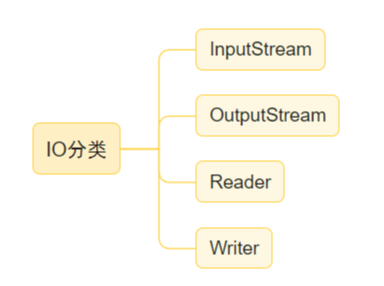

## 2. IO模型讲解

https://www.processon.com/view/link/64a8d8d01906b3205606463f

## 3.select、poll和epoll讲解

https://www.processon.com/view/link/654cba3a2a499a6f61dac0c2

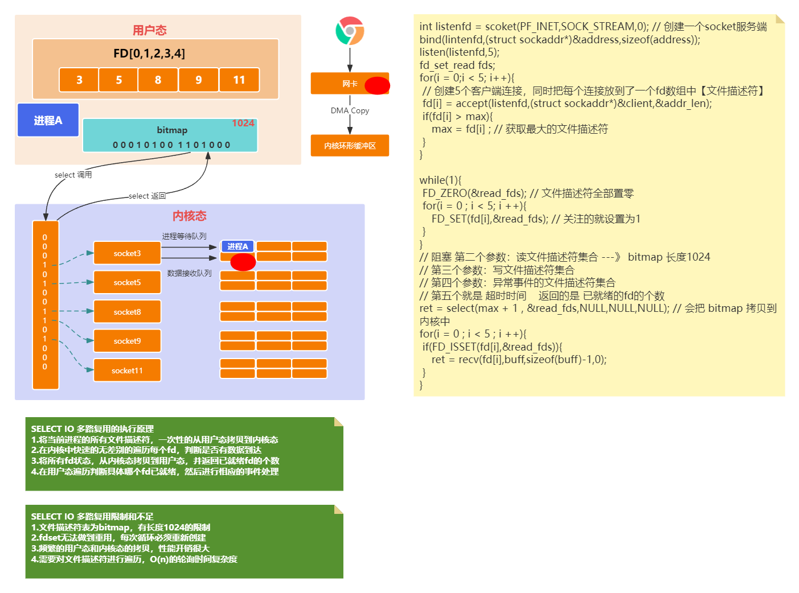

https://www.processon.com/view/link/654cba44833c705155be82bb

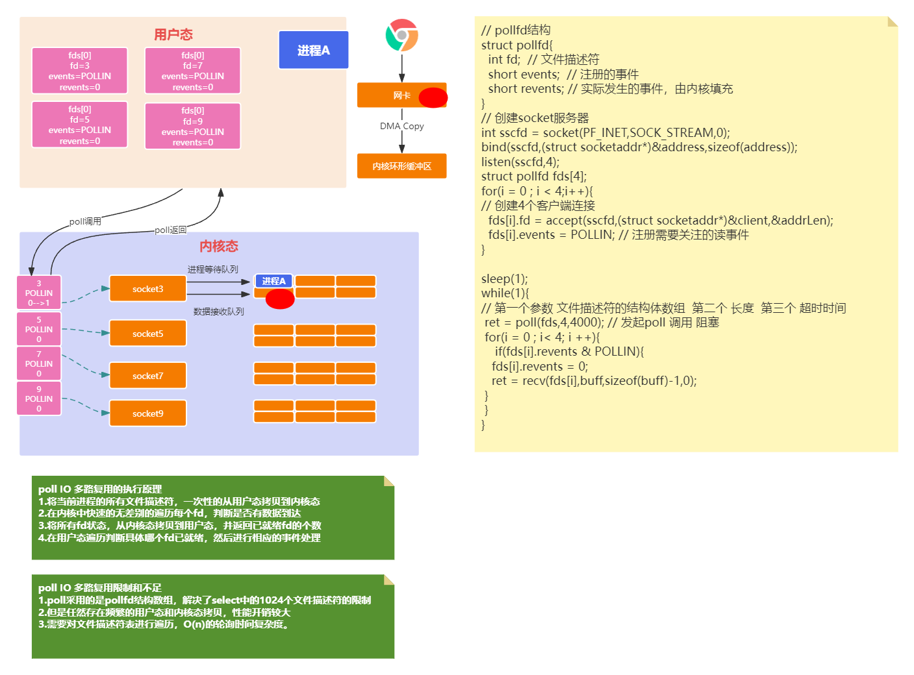

https://www.processon.com/view/link/654cba4d7aa468729682d1de

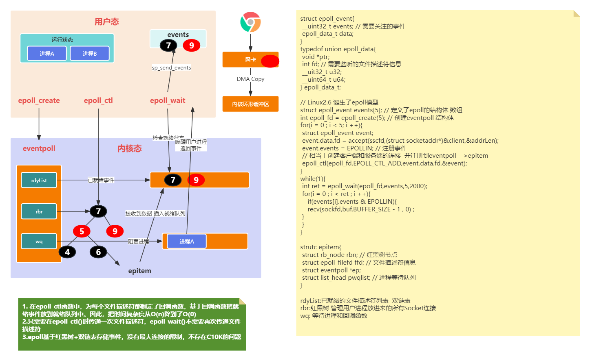


# 四、Java线程核心


